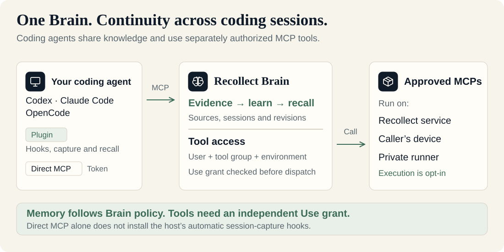
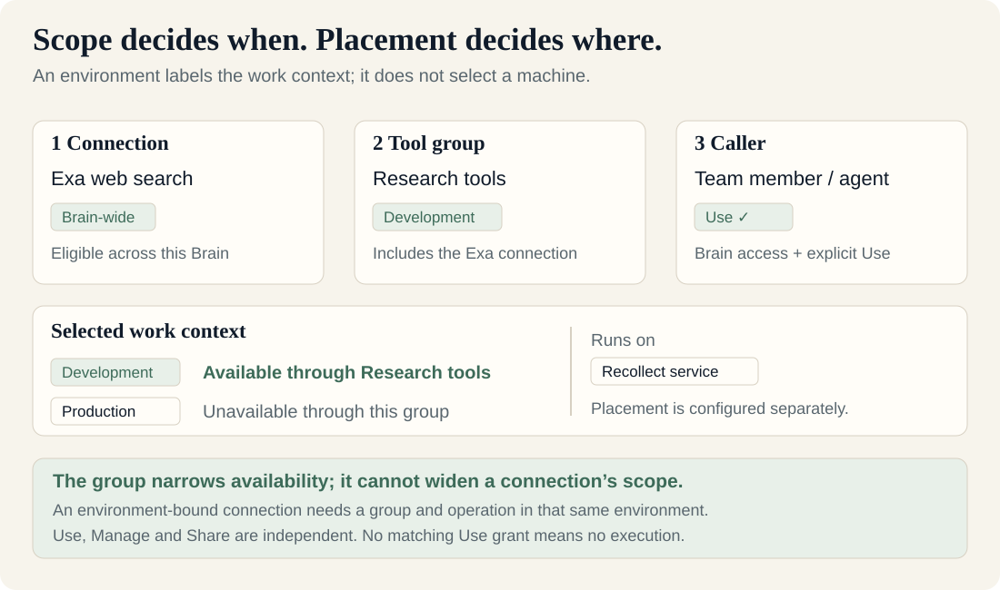
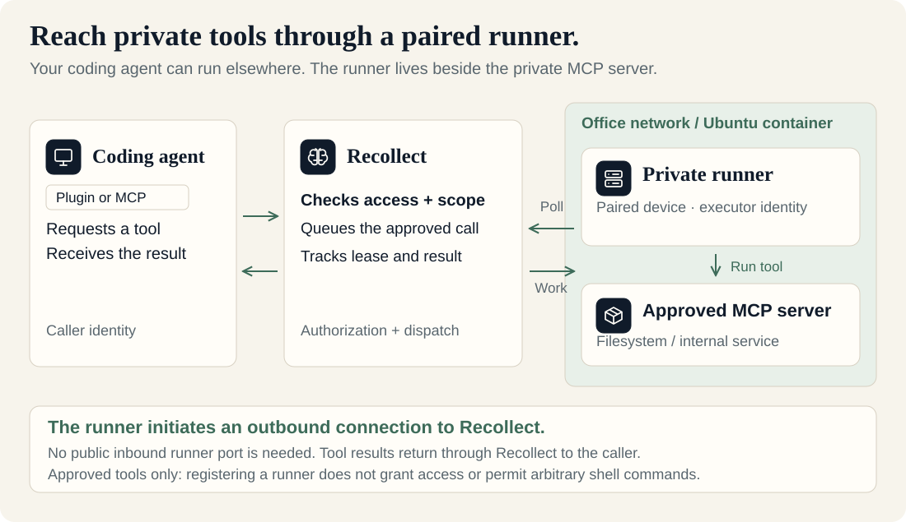

<p align="center">
  
</p>

<p align="center">
  <strong>Self-hosted AI memory and MCP coordination for coding agents.</strong><br />
  Keep context across repositories, tools and coding sessions.
</p>

<p align="center">
  <a href="LICENSE"></a>
  <a href="docs/foundation/techstack.md"></a>
  <a href="docs/runbooks/agent-memory-tools.md"></a>
  <a href="docs/runbooks/installation.md"></a>
</p>

<p align="center">
  <a href="#run-locally">Quickstart</a> ·
  <a href="#connect-your-coding-agent">Connect your agent</a> ·
  <a href="#environments-and-tool-access">Tool access</a> ·
  <a href="#private-runners">Private runners</a> ·
  <a href="#what-it-does">Features</a> ·
  <a href="#documentation">Documentation</a> ·
  <a href="https://github.com/MikeK184/Recollect/issues">Issues</a>
</p>

**Recollect gives Codex, Claude Code and OpenCode persistent memory for engineering work.**
Bring repository knowledge, documents, decisions, runbooks and supported agent
sessions into one place, so the next session can pick up where the last left off.
Run it on your own machine or a private server, and inspect the same knowledge in
a desktop web UI.

It combines long-term agent memory, knowledge graphs and hybrid search with a
Model Context Protocol (MCP) coordinator. Memories stay connected to their
sources, repository revisions and environments. You control what is captured,
what can be sent to a model and which tools an agent may use.

> **Early project:** intended for individuals and trusted internal teams.
> The desktop redesign and private-runner workflow have local acceptance evidence.
> [Remaining work and limits](docs/roadmap/execution/active/README.md) include
> further native-host direct-MCP acceptance and memory evaluation.



## When to use Recollect

- **Continue work across sessions.** Keep decisions, investigations, fixes and
  handovers available to the next coding agent.
- **Understand a workspace across repositories.** Connect code and configuration
  relationships with documentation, revision history and environment knowledge.
- **Share context with a team.** Organize knowledge in access-controlled Brains
  and give agents separately authorized tools for the work they need to do.

## Run locally

Install Docker with Compose and Python 3.11+, then run:

```sh
git clone https://github.com/MikeK184/Recollect.git
cd Recollect
./scripts/stack.sh up --build
```

Open **http://127.0.0.1:8787**. The first run generates login credentials in the
ignored `.env` file: use `RECOLLECT_OWNER_USERNAME` and `RECOLLECT_OWNER_PASSWORD`.
The script builds the application and starts the complete `recollect` Compose
group: PostgreSQL, Neo4j, UI/API and worker, with a one-shot migration first.

```sh
./scripts/stack.sh stop         # Stop everything; keep all data
./scripts/stack.sh up           # Start again
./scripts/stack.sh status       # Show service state
./scripts/stack.sh logs         # Follow API and worker logs
./scripts/stack.sh up --build   # Rebuild after code or UI changes
```

The root [compose.yaml](compose.yaml) also supports standard `docker compose`
commands. Use `./scripts/docker.sh compose` if your Docker installation needs the
repository's CLI wrapper. `stop` keeps containers and data; `down` removes the
containers/network and keeps data. Do not add `--volumes` when retaining data.

For native development, stop the Compose stack, install Rust/Cargo and Node.js/npm,
then run `./scripts/dev.sh`. It runs only the databases in Docker and starts the
API and worker in the terminal. Stop it with Ctrl+C before returning to Compose.

Learning and semantic search require an `OPENAI_API_KEY` in `.env` and an enabled
Brain model policy. Model requests are billed by the provider. Browser-created
Brains include the managed autonomous preset. Existing Brains keep their policy
until **Enable autonomous memory** is selected; API creation defaults remain
disabled unless managed setup is requested.

For Docker installation and shared HTTPS access, see the
[installation guide](docs/runbooks/installation.md).

## Connect your coding agent

Open **Agents → Connect agent** for Codex, Claude Code or OpenCode.
Install the [packaged plugin](plugins/recollect/README.md), connect once to your
Brain, then start your coding host normally. The plugin bundles automatic capture,
cited memory recall, local checkout discovery and repository publication.
Independent local/private tool execution is optional through `--with-runner`.
Advanced direct HTTP MCP remains available. Public marketplace distribution and
native MCP OAuth login are not available yet.

| Start here | Guide |
| --- | --- |
| Connect Codex, Claude Code or OpenCode to a Brain | [Agent memory and MCP setup](docs/runbooks/agent-memory-tools.md) |
| Capture supported sessions and tool observations | [Automatic session capture](docs/runbooks/session-capture.md) |
| Work across repositories, areas and environments | [Workspace scope](docs/runbooks/workspace-scope.md) |
| Configure managed tools, credentials and private runners | [MCP catalogue](docs/runbooks/mcp-catalogue.md) and [runtime](docs/runbooks/mcp-runtime.md) |

The connection guide covers host configuration and a real tool-call check.
Session capture depends on the supported host's hooks and your Brain's policies.
Direct MCP uses a host configuration and access token; it does not install the
plugin's automatic session-capture hooks.

For reproducible quality evidence, see the [public retrieval benchmark](docs/runbooks/public-memory-benchmark.md)
and its [measured results and limits](docs/mappings/public-memory-benchmark-2026-09-28.md).

## Environments and tool access

Set up a connection once, include it in a **tool group**, and grant people or
groups **Use**. Choose an environment when the tools should be available only
for that work context. Execution placement controls where the server runs.

| Setting | Responsibility | Example |
| --- | --- | --- |
| **Connection scope** | Where the MCP connection is eligible within its Brain | Brain-wide, or only Development |
| **Tool group** | Which connections a caller can use, with optional environment scope | Research tools contains Exa and requires Development |
| **Use / Manage / Share** | Independent permissions to run tools, edit a group, or grant access | A reader can Use without Manage or Share |
| **Runs on** | Where approved tools execute | Recollect service, the caller's device, or a named private runner |



A Brain-wide connection can belong to an environment-specific tool group. That
group limits its use to the selected environment; it does not move the MCP server.
An environment-bound connection can only belong to a group in that same
environment. A group cannot widen a connection's scope.

Without an enabled matching tool group and an explicit Use grant, the agent
cannot execute that connection's tools. Brain administrators inherit Manage and
Share, **not Use**. Grants are additive: another eligible group can still grant
access. See the [catalogue guide](docs/runbooks/mcp-catalogue.md) for setup.

## Private runners

A private runner is an optional executor on a **paired device inside your
network**. Use it for a filesystem MCP, internal service or another approved tool
that the Recollect service cannot reach directly.



The runner initiates an outbound connection to your Recollect endpoint, claims
its addressed work and returns the result. It needs access to Recollect and the
MCP server; it does not need a public inbound port. Your coding agent can be on
another machine and use either the plugin or direct MCP.

In **Connections → Private Runners**, add a paired device, copy its setup command
and start the runner there. Assign a connection to that runner, then include it
in a tool group with the caller's Use grant. The runner card shows its device,
assigned MCP connections, approved tools and linked tool groups. A connection
badge describes placement; the runner's live status describes connectivity.

Registering a runner does not install an MCP server or grant tool access.
Executable commands, arguments and tool schemas come from approved definitions;
an agent cannot turn the runner into an arbitrary shell. The plugin's automatic
memory integration and optional execution runner have separate responsibilities.

See the [private-runner setup guide](docs/runbooks/mcp-vault-and-private-runners.md)
and the [Ubuntu filesystem proof](docs/mappings/private-runner-ubuntu-proof-2026-10-06.md).
That local proof covers a real MCP caller, permitted reads, access denials and
offline recovery; it does not claim a fresh LLM host session or production deployment.

## What it does

| Capability | What you get |
| --- | --- |
| **Persistent agent memory** | Decisions, claims, procedures and handovers that can be reused across sessions, with supporting evidence and correction history. |
| **Brains and collections** | Personal or shared knowledge spaces with access controls; collections group sources, while areas and environments provide overlapping views. |
| **Hybrid retrieval** | Exact, keyword, semantic and graph search with source references, scope and revision filters. Investigation and strict recall expose different trust requirements. |
| **Knowledge and code graphs** | Explore source-derived code/configuration relationships and knowledge links, with supported cross-repository paths and queued graph analytics. |
| **Automatic learning** | Capture, learn, revise and retire memories under standing policies. Manual review, corrections, withdrawal and erasure remain available. |
| **MCP coordination** | Connect agents to approved tools locally, centrally or through private runners. Tool execution has its own grants; Vault is an optional credential source. |
| **Desktop web UI** | Browse sources and memory, inspect graphs and processing, and see managed tool calls alongside their recorded outcomes. |

### How the pieces fit together

A **Brain** holds the knowledge and access rules for a person, team or project.
Collections, repository snapshots and permitted session captures provide evidence.
Memory processing derives claims and relationships; hybrid retrieval selects
relevant context for the coding agent or UI, retaining links to that evidence.

PostgreSQL owns canonical records and policy state, pgvector supports semantic
retrieval, and Neo4j/GDS supports graph traversal and analytics. Rust powers the
API, workers and bundled plugin runtime; React provides the desktop UI. The same stack
runs locally or on a private server.

Recollect owns its Rust core. [Cognee](https://github.com/topoteretes/cognee) and
other memory systems inform the design; Cognee is not a required runtime.

## Documentation

| I want to… | Start here |
| --- | --- |
| Run locally or set up shared HTTPS access | [Installation](docs/runbooks/installation.md) |
| Develop the backend or UI | [Local development](docs/runbooks/local-development.md) |
| Learn where features live in the desktop UI | [Desktop guide](docs/runbooks/desktop-experience.md) |
| Configure learning and model access | [Provider and learning policies](docs/runbooks/provider-learning.md) |
| Operate memory, graphs, MCP and recovery | [Operation guides](docs/runbooks/README.md) |
| Understand the product and architecture | [Vision and technology stack](docs/foundation/README.md) |
| See current work and remaining acceptance | [Roadmap](docs/roadmap/epics/index.md) |

## Project status

The first planned product scope is implemented and locally tested. The desktop
redesign, compact tool access and private-runner relationship cards have local
acceptance evidence; mobile views are deferred. The
[active execution index](docs/roadmap/execution/active/README.md) tracks remaining
direct-MCP native-host acceptance and the blocked LongMemEval evaluation.
The [evaluation report](docs/mappings/integrated-evaluations-2026-09-26.md)
records measured results, failures and limits. Local validation is not a
production capacity or deployment guarantee.

## Contributing

Issues and focused pull requests are welcome. Include relevant tests for behavior
changes and run `./scripts/validate.sh` for the documentation checks. See
[AGENTS.md](AGENTS.md) for repository conventions and the development guide for
product tests.

## License

Licensed under [Apache-2.0](LICENSE).
