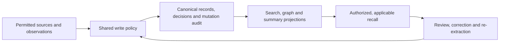

# Recollect Vision

Status: accepted

October 1 integration amendment: [ADR 0018](../adr/0018-plugin-managed-agent-memory.md) packages the Rust local memory runtime inside host plugins. Separate companion setup is replaced by plugin-managed capture and recall; independent execution remains an explicit optional runner. Existing backend and evidence guarantees remain.

Revised baseline: 2026-09-13, incorporating the user's approved Atlas-informed
plan and clarification that the MCP coordinator, Vault integration, Brain areas,
dataset-like collections and graphs remain product requirements. Rust is selected
for Recollect's own backend and host plugins. This supersedes the mandatory Cognee
extension direction. These are intended capabilities, not delivered functionality.
Product epics follow from these foundations.

## Purpose and audience

Build an independent engineering memory and MCP coordination product for one
person or an internal team and their coding agents. Brains organize personal,
team, project or customer work across repositories, knowledge and environments.
Customer users, multi-organization onboarding and SaaS federation are outside
the initial scope. Support the same self-hosted stack locally or on a shared
private server, with local host plugins and approved private-network runners.
Recollect owns its identities, evidence, correction rules, permissions and
execution model. Existing memory systems, extractors and libraries provide
ideas and reusable components; Cognee is a reference and optional integration.

An engineer should start Claude Code or Codex in a customer workspace such as
`bankit/`, discover its roughly 50 repositories, and investigate related systems
without restarting or manually binding the agent to one repository at launch.
Another engineer can contribute knowledge from different local paths. Agents
in separate Brains and concurrent tasks must remain correctly isolated.

Configuration selects the Brain. Agents select their working scope inside that
Brain. Permissions control the execution profiles they may use.

The characteristic question is: "How is Vault configured in production, which
repository revisions support that answer, when was it last observed, how does
development differ, and may this agent inspect production now?" The answer must
connect knowledge, evidence and capabilities without confusing their authority.

## One memory model, complementary methods

Use a hybrid model with one shared lifecycle and several useful memory forms:

| Form | Purpose |
| --- | --- |
| Evidence and episodic records | Retained permitted documents, source versions, events and tool observations with actor, scope, target and time |
| Semantic claims, decisions and synthesis | What sources assert, what people decided, and explanations/handovers derived from named supporting records |
| Procedural memory | Runbooks and repeatable procedures with provenance, tested conditions, environment/revision applicability and outcomes |
| Structural knowledge | Source-derived code/configuration relationships, distinguished from model-inferred relationships |
| Working context | Temporary task/subagent scope and context; deliberate contributions enter the durable write lifecycle |

Combine exact identity lookup, lexical search, semantic similarity, graph
traversal and graph analytics. Temporal and revision filters select applicable
information; ranking selects useful information within that boundary. One claim may appear
in several indexes while retaining one identity and correction history.
Graphs, embeddings and summaries are representations, not independent writers
that may decide their own truth. Retrieving a procedure does not authorize it.

Choose methods by measured engineering-task value. Exact/lexical retrieval is
the baseline; semantic search addresses paraphrases, and validated graph paths
address relationship questions. Neither a universal winning memory engine nor
the usefulness of every method on every query is assumed.

## Brain and scope

A Brain is the neutral workspace containing knowledge, areas, environments,
repositories, collections, graph snapshots, configured connections/profiles,
and access rules.
Areas and environments are overlapping associations and views: Production →
Vault and Vault → Production show the same associated knowledge. Decisions can
be Brain-wide, and handovers can span multiple repositories or areas.

| Part of a Brain | What an engineer can use |
| --- | --- |
| Knowledge base | Documents, imported sources, explanations and evidence-backed answers |
| Repository graphs | Code/configuration relationships, dependencies and impact analysis tied to exact commits |
| Repository memories | Decisions, conventions, investigations, corrections and handovers associated with repositories |
| Environment knowledge | Development/staging/production views separating intended configuration from observed deployment |
| Procedures | Runbooks with tested conditions, successes, failures and provenance |
| Session memory | Sanitized supported conversations and tool observations, plus selected durable findings |
| MCP connections and profiles | Approved tools, targets, permissions, credential references and execution locations |

Named collections provide dataset-like source organization, import, processing,
update tracking, retrieval and removal within a Brain. They reuse the Brain's
knowledge grants initially. Recollect owns this model; it does not require
Cognee's dataset schema, NodeSets or a separate physical database for every
collection, repository or area. This is the required capability set, not a
promise to reproduce every Cognee connector, pipeline or optimization.

Areas cut across content types. A Vault area can connect documentation,
repository relationships, decisions and runbooks; selecting Production narrows
that view to applicable evidence. One record can appear in several views with
one identity, ownership and correction history. Removing an association does
not erase the shared underlying record. Erasure is a separate explicit action.

Keep flexible grouping and associations. Use dependable structured identities for
Brain, repository, environment, revision, and evidence status; tags alone must
not carry authorization or revision semantics.

The proposed customer-root configuration is intentionally small:

```toml
# Proposed product configuration; wire format and naming need a contract.
# File: bankit/.recollect/workspace.toml
brain = "bankit"
```

Backend URL and authentication belong to personal plugin settings. Repository,
area, environment, and execution profile are not required in this file.
Discovery builds a lightweight, refreshable checkout catalogue; it does not
extract every repository at every launch.

The workspace file is stored once at the workspace root; an agent may start
in a repository or subdirectory below it. Discover it by walking parent
directories, with the nearest workspace file defining the boundary. Nested
workspaces are separate boundaries and are excluded from the enclosing
workspace's repository discovery. Do not combine their Brains implicitly or
rebind an existing task merely because its working directory changes.

The plugin should list repositories, areas, environments, and authorized
profiles, and let agents request a validated working scope. Candidate operation
names are `workspace.list_repositories`, `workspace.list_areas`,
`workspace.list_environments`, `workspace.set_scope`, and
`workspace.list_profiles`; their wire contracts remain future work.

Scope handles belong to a task/subagent and fix the scope of each retrieval,
write, capture event, and tool invocation when it starts. Switching a default
cannot relabel in-flight operations. Recall newly relevant context immediately
after a scope change. Multi-repository handovers preserve all contributing
scopes. Selecting production does not start an MCP or grant execution rights.

## Repository identity and retained knowledge

Use a stable repository UUID with a visible canonical full origin such as
`gitlab.com/bankit/infra/vault`. Normalize equivalent HTTPS/SSH representations,
remove credentials, and handle aliases, custom ports, moves, and forks
explicitly. Checkout paths are per-user/device registrations. An `origin`
value identifies a repository; it does not authorize publication into a Brain.

Keep Git clones and ordinary working trees on engineers' machines by default.
Centrally retain derived structural facts, relationships, imported documents,
decisions, approved summaries, provenance, and source references identifying
repository, commit, file, and line range. Raw file contents and selected code
excerpts require an explicit capture/storage policy. Derived graph properties
and tool traces also need inspection; they can contain sensitive source text.

Local extraction must use an exact committed tree. Publish authenticated,
validated snapshots with commit, extractor/version, settings hash, contributor,
and capture time. Preserve immutable artifacts and deduplicate equivalent
contributions without dropping contributor history. A dirty checkout must never
be published as an unchanged HEAD snapshot.

The shared service remains useful when a contributor is offline: its published
graph and knowledge are queryable. Arbitrary source files may be unavailable;
report that limitation instead of inventing their contents.

Evidence may be retained centrally under policy or referenced in a durable
controlled source such as Git. Preserve exact source versions, locations and
hashes; an ID alone does not preserve historical bytes. Rebuild guarantees
depend on retained inputs and source availability. Provenance establishes where
an assertion came from, not that it is true. Plans and decisions remain useful
memory when clearly identified as intent.

## Revisions and evidence

Fifty repositories remain fifty identities even when each participates in four
environments. An environment selects repository snapshots and relevant config
paths. Separate committed, desired, and observed-deployed revisions.

Use explicit revision manifests for reproducible combined views. Support
federated retrieval across authorized repository graphs and actual traversal
across repositories through a validated combined-snapshot/linking pipeline.
Preserve unresolved-link and extraction-coverage information. A
scope label or a collection of search results is not deployment proof or proof
that a graph path exists.

Provide both knowledge graphs (systems, concepts, evidence, claims and decisions)
and repository graphs (source-derived code/configuration structure). The browser
must support exploring relationships and their evidence. Deep traversal,
centrality, clustering and large-graph analysis belong in the first usable
version. Heavy analysis runs as bounded background jobs over selected manifests,
with visible progress, resource limits and reproducible input references. It is
not a promise of instant computation over every retained repository history.

Knowledge should expose source → extracted claims → synthesized knowledge,
with editable sources, claim revisions, review, and revalidation state. Keep
review (proposed/accepted/rejected), freshness (current/needs verification/
superseded), and operational state (declared/implemented/deployed/verified)
separate. Reassess only claims affected by changed evidence and revision
manifests; development moving forward must not automatically stale production
claims still supported by their selected revision.

Track when an asserted fact held separately from when Recollect recorded or
revised its knowledge of it. Late-arriving evidence must distinguish "what held
then?" from "what did we know then?" Keep prior knowledge versions, unknown
validity endpoints and observation precision. A Git commit date is not a
deployment time, and one observation does not prove uninterrupted operation.
Environment manifests and these two time dimensions remain separate concepts.

## Correction and learning loop

Every initial write, import, extraction, correction, review and re-extraction
uses the same logical mutation policy. Background work proposes changes through
that boundary too. Human decisions and applicable rejection rules are durable
inputs to reconstruction; rebuilding a search index must not undo a correction.



The policy authenticates the actor and write destination, validates evidence
and applicability, checks conflicts and rejections, and records an explicit
disposition. Canonical changes, audit and durable projection work commit
together. Readers enforce current canonical policy even while projections lag.
Corrections must affect model-facing answers as well as the review screen.

Use autonomous learning and maintenance under a standing Brain policy. Models
interpret and reconcile evidence; workers accept supported routine knowledge,
revise it, retire obsolete material and enforce retention/erasure without a human
checking each record. Unresolved evidence remains explicitly uncertain while work
continues. Human inspection and correction are optional interventions. The 2026-09-28
clarification makes managed defaults the normal setup: people do not tune token
budgets, capture kinds, result counts or per-record lifecycle decisions. Agents
select useful scope and context through the plugin; the UI explains progress and
supports optional intervention. See the [managed experience](../contracts/memory-managed-experience.md). Automatic
acceptance records its policy and never claims human review or operational proof.
Preserve the origin and actual evidence class. This 2026-09-14 clarification is
governed by [ADR 0006](../adr/0006-autonomous-memory.md).

Resolve disagreements explicitly: keep the supported assertion, keep both with
different applicability, retract, or create a policy-backed or reviewed replacement. Record the
actor and reason. A newer timestamp or a model's confidence cannot settle a
conflict by itself.

Reject values within their relevant Brain, subject and evidence/applicability
conditions. A new record ID, equivalent evidence or an unrelated new commit
must not silently reactivate a rejected assertion. Materially changed evidence
may justify review or explicit revalidation. A rejection must not become a
global ban on a fact that is valid in another environment or period.

Old source text remains historical evidence when policy permits, but raw search,
cached summaries and graph/vector results must not reintroduce a withdrawn
assertion as current accepted knowledge. Ordinary investigations include useful
proposed/disputed material with clear status and provenance. Strict accepted or
operational context is a separate mode and excludes claims that do not meet its
declared policy. Historical queries explicitly select fact/knowledge time;
ordinary queries use the selected manifest and latest knowledge state.

Correction applies to derived analytics too. Removing an edge from a displayed
result does not remove its influence on a ranking or cluster. Invalidate affected
current results and recompute from eligible inputs; retain older reports only
as clearly qualified history when policy permits.

## Capture, retention and model policy

Automatically capture sanitized supported prompts, replies and tool observations
under the selected Brain's policy. Redact and apply content/size exclusions before
local persistence and upload. A durable local inbox separates quick capture from
later model enrichment. Retain host/version, event identity and scope, and show
missing coverage or ambiguous subagent attribution. Host hooks do not guarantee
complete transcripts or visibility into every tool.

Sanitized session and tool-output records have a 30-day retention default, with
per-Brain overrides. Permitted supporting excerpts retained with durable claims
have their own policy and provenance. Explicit documents, repository artifacts,
claims, decisions, audit, rejection records, caches and backups need separate
retention rules. Expiring the sole source changes what can be verified/rebuilt;
do not silently preserve an entire transcript to evade its expiry.

Distinguish correction, ordinary supersession, Withdraw and Erase. Withdraw
removes an assertion from current accepted use while preserving qualified history.
Erase removes controlled content and dependent copies/projections, fences queued
work and leaves only permitted minimal audit metadata. Independently supported
records are evaluated separately. State backup expiry and enforce erasure before
a restored instance serves recall; do not promise deletion from uncontrolled copies.
Editing a source inside Recollect creates a new attributable version. Git or
other external-source writeback is a separate future connector operation.

Each Brain explicitly allows providers, models, purposes and content classes
for generation, extraction, embeddings and external reranking. Permission to
capture is distinct from permission to send content to a model provider. Deny
unapproved transmission and fallbacks; apply budget and concurrency limits.
Provider credentials, models and regions are deployment inputs, not fixed product
defaults. Local capture and exact/lexical retrieval can work without model calls.

## Seven required capabilities

All seven Atlas capabilities are part of the intended product. Their presence
must eventually be demonstrated through the actual product paths, not inferred
from a field, a UI label or the number of marks held by a reference system.

| Capability | Recollect obligation |
| --- | --- |
| Rejected-value tombstone | Preserve applicable rejection across re-extraction, retries, rebuilds and restarts; distinguish rejection from ordinary supersession and privacy deletion |
| Explicit trust state | Keep review, freshness and operational state independent; confidence, popularity and pinning cannot confer authority or verification |
| Bi-temporal validity | Preserve fact applicability time and the history of when the system learned/revised it |
| Scope enforced | Enforce authenticated Brain access and operation scope across reads, writes, jobs, caches, exports and projections |
| Mutation audit | Record actor, reason, affected identities/versions and disposition with canonical changes; retrieval telemetry is separate |
| Human review | Provide usable UI/API actions to inspect evidence, accept, reject, correct, withdraw and resolve conflicts through the same mutation service |
| Negative evaluations | Assert that forbidden, rejected, deleted or wrongly scoped material does not enter ordinary context, paired with assertions that permitted useful material does |

The rubric describes mechanisms rather than ranking overall product quality.
Recollect additionally needs authority, concurrency/recovery, source availability,
capture/deletion policy, runner security and measured retrieval/operating quality.
[Atlas rubric](https://neoneye.github.io/agent-memory-atlas/methodology/atlas-rubric/#the-seven).

## MCP coordinator and Vault integration

The MCP coordinator is a core product capability. It exposes Recollect memory
and workspace operations to agents and routes authorized calls to Brain-managed
MCP connections. A Brain may operate without configured connections; this does
not defer the coordinator or Vault support out of the first usable product.

| Concept | Meaning |
| --- | --- |
| MCP definition | Approved implementation, executable/container, transport, configuration schema |
| Connection | Configured target, credential reference, environment association, and runner placement |
| Execution profile | Named group of connections with explicit use/manage/share permissions |
| Runtime instance | Actual process or established connection with leases and lifecycle state |

Execution profiles in this product are distinct from this repository's
documentation execution packs.

Connections may be Brain-wide or environment-specific. A documentation profile
could group GitLab and Confluence; production infrastructure could add approved
Terraform/Kubernetes connections. Agents may discover and request authorized
profiles, including an unambiguous environment/profile mapping. They cannot
replace a connection's executable, target, runner, or credentials via arguments.

On the first authorized call, resolve the approved runner and credentials,
acquire a startup lock, start/connect as needed, and hold an operation lease.
Reuse must respect credential and session isolation. Stop an owned backend
after 15 minutes without useful activity, only when no active work needs it.
One session ending must not interrupt another. Tool discovery uses an approved
catalogue and must not wake every backend. External hosted MCP processes are
not ours to terminate; release only our connection.

## Deployment and access model

Use the same memory service locally or on a shared private server, with mixed
execution. Local host plugins discover checkouts, extract committed snapshots,
and run local MCPs. The central Recollect service
stores knowledge, graphs, registries, and permissions, and may run API-only
connections. Approved private-network runners support services unreachable
from the laptop or central VM. An MCP URL or runner determines placement;
pointing memory at a VM cannot spawn a process on a laptop.

Recollect owns users/principals, roles and resource grants. Initially,
areas and environments inherit Brain knowledge access and are not separate
document security boundaries. Apply grants and revocations to every Brain
resource, including direct API and optional backend paths. Execution-profile grants target
the same principals separately. Reading production knowledge never implies
production execution; administrators need explicit profile-use permission too.

Support built-in local accounts and optional single-organization OIDC. Personal
setup creates one owner; teams invite local accounts or connect their existing
identity provider. Public signup is disabled. Entra ID remains a supported
integration target where used, without becoming a prerequisite for personal or
team use. Administrator-defined mappings connect authenticated identities to
Recollect principals, Brain grants and separate profile permissions. OIDC
establishes identity; Recollect enforces access. Companion pairing yields
individually revocable device credentials. Membership synchronization and active
operation revocation require explicit implementation contracts.

Brain-managed resources require an explicit ownership and provisioning policy.
Contributor identity is recorded separately from resource ownership. Removing
an engineer from an SSO group or role must not be assumed to revoke
owner privileges or independently granted access. Choose a supported ownership
arrangement before shared resource creation, and test every effective access path.

Recollect authorizes operations through its APIs, host plugins, and managed MCP
connections. It does not restrict arbitrary shell commands or unrelated
credentials available to an unrestricted local agent. Denying a production
profile is therefore a boundary on Recollect-managed operations, not a claim
that another shell tool cannot use an existing local kubeconfig.

Once effective authorization is revoked, deny new managed calls and credential
renewals. The implementation contract must separately define how quickly group
changes are observed, how cached sessions/grants expire, and whether an already
running operation is cancelled or allowed to finish safely. Revocation is not
automatically cancellation or invalidation of credentials already issued.

Vault is a supported credential integration for MCP connections. Approved
credential references bind the target and authorized runner; credentials enter
that runner's execution environment, never model context or captured memory.
Coordinate renewal, rotation, draining and restart with active operation leases.
Local execution necessarily places connector credentials on the local runner.
Personal installations can instead use the OS credential store or approved
environment injection. Vault installation is optional; Vault integration remains
part of the product. Recollect does not build its own general secret store.

## Pilot success and limits

Demonstrate one customer-root session moving across repositories and
environments, concurrent task isolation, shared contributions from different
checkout paths, authenticated graph publication, permission revocation, and
correct first-use/idle backend lifecycle. The UI must show scope, provenance,
freshness, authorized capabilities, and meaningful unavailable states.

Also demonstrate correction survival through regeneration, late-arriving
evidence without rewritten history, source-linked useful retrieval, and paired
negative/positive checks across API, MCP, review and background paths.

The first usable version includes collections, both graph forms and queued graph
analytics, actionable review, the MCP coordinator and Vault credential integration.
Validate personal use and two users sharing a Brain, including strict versus
investigation recall, provider restrictions, capture expiry and Withdraw/Erase.
Database and graph-analytics components must require no paid license; hosting,
storage and model usage can still incur costs.

The proposed 8-CPU/32-GB/1-TB VM is a pilot assumption, not measured capacity.
It assumes external LLM/embedding services, local extraction, bounded ingestion,
and limited central instances. Benchmark imports, combined queries, concurrent
sessions, cold starts, memory peaks, queues, and storage growth. Keep backups
outside the VM. Bound local extraction/process workloads too.

The initial direction excludes a Git-hosting replacement, full mirrors by
default, a new parser/database/model engine, universal deployment discovery,
and a general sandbox platform. An owned memory domain is intended; replacing
every underlying component is not required. No capacity, LOC or language-based
performance guarantee is made.

Derive product epics from this foundation in dependency order: runnable stack and
identity; evidence capture/publication/recovery; retrieval/review/corrections;
graph traversal/analytics; managed MCP/private runners and integrated workflows.
These are delivery stages within the selected product, not permission to remove
later stages from its first usable scope. Resolve detailed schemas, APIs, policy
rules and deployment service levels before their dependent implementation.

Defer adaptive decay/tier promotion, learned retrieval gates, automatic executable
skill learning, external-source writeback and a general plugin marketplace.
Keep useful runbooks and explicit review from the start. Atlas informs the design;
it supplies neither a complete implementation nor measured proof of superiority.
See the [foundation research mapping](../mappings/atlas-foundation-decisions-2026-09-13.md).
