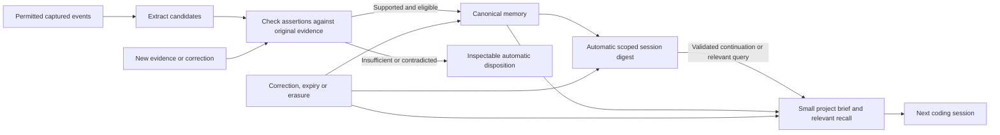

# Automated memory improvement plan

Status: locally implemented and validated; deployment not performed
Updated: 2026-10-07

The user requested a two-agent comparison and then authorized the complete
implementation. All five phases are implemented in the local working tree.
[Implementation and evaluation evidence](../mappings/memory-source-support-staging-2026-10-07.md)
records native enforcement/recovery tests, two independent reviews and the frozen
actual-model comparison. The final v3 held-out run withheld all 15 negative cases
and delivered all 11 positive controls, meeting the predeclared threshold. Earlier
failed verifier versions remain in the reported comparison.

The archived execution packs record local acceptance. Deployment, upgrading the
installed plugin, release, commit and push remain separate. The design and
acceptance sequence below is retained; it no longer describes unimplemented work.
The [dated Muse comparison](../mappings/muse-memory-comparison-2026-10-07.md)
separates official claims, an unverified runtime export and Recollect source proof.

## Intended product experience

Install the plugin, connect once, and use the coding host normally. Under the
Brain's standing content/provider/cost policy, Recollect captures permitted
events, extracts candidate memory, checks its support, consolidates useful work,
updates applicable knowledge and supplies context in later sessions. Nobody must
request a digest, start a nightly job, approve routine claims, resolve every
ambiguity, or manually maintain a project brief.

Automatic does not mean transmitting unapproved content, ignoring a cost cap,
inventing missing capture, or executing retrieved procedures. A paused budget,
coverage gap or unresolved assertion is a recorded outcome while unrelated work
continues. Inspection and human correction remain optional overrides.

## Delivered behavior

| Capability | Local implementation | Result |
| --- | --- | --- |
| Capture and learning | Reuse authenticated captures, canonical evidence, gateway and durable jobs | No new transcript scraper or VM |
| Evidence support | Typed staging, complete assertion assessment, exact evidence quotation guard and shared consumer predicate | Unsupported unreviewed memory cannot become usable context or replace a supported head |
| Generated handovers | Independently checked prose and automatic settled-session generation | Current scoped continuation with honest receipt coverage |
| Plugin context | Deterministic project brief and authenticated continuation alongside ordinary recall | Same six-record/8 KiB/eight-second cap; no additional brief model call |
| Revision | Bounded exact-family discovery after extraction and independently assessed frozen targets | Supported corrections across sessions, protected human decisions and preserved history |
| Long-lived support | Automatically retain minimal exact excerpts under original and excerpt permissions | Ordinary raw expiry can preserve supported knowledge; original erasure still removes copies |

Existing safeguards and dated real-model success must not be discarded. The
September 15 proof exercised four synthetic real-Luna events, including suggestion,
history and an explicit tool correction. It is narrow retained evidence, not a
current adversarial semantic-quality evaluation. Some current ambiguity tests
preassign empty provider output; these test compliant-output handling rather than
rejection of an unsupported generated assertion.

## Shared design decisions

1. **Support is separate from truth.** A verifier checks what a source supports.
   It cannot establish that a source is truthful or that production was changed.
   Preserve review, freshness, operational state, fact time and knowledge time.
   User assertions, assistant proposals and reported tool outcomes remain distinct.
2. **Use one canonical lifecycle.** Add governed typed staging and support
   assessments alongside existing memory/jobs, not editable Markdown files as a
   second authority. Persist only required typed payloads and exact dependencies;
   do not retain unrestricted provider responses. Include new records in RLS,
   retention, cancellation, deletion-journal replay and restore barriers.
3. **Gate every consumer.** Investigation currently allows proposed and qualified
   records. An `uncertain_evidence` label alone does not exclude a candidate from
   ordinary model context. Unchecked/unsupported machine-maintained generated
   material must not enter model-facing recall, synthesis, ranking/graph inputs
   or cached context. Only a server-validated explicit human review/correction
   decision supplies the protected review exception, with the existing
   evidence/rule eligibility still enforced. `browser_authored` and
   `device_authored` identify a transport, not human authorship or approval.
   Unreviewed direct contributions, including `memory.contribute`, receive the
   automatic support assessment and delivery gate too; do not trust them merely
   because they bypassed server extraction. Assessment does not grant permission
   to rewrite author-owned text or a human decision. An
   explicit inspection path can show its disposition without promoting it.
4. **Preserve authority.** Machines cannot overwrite human-authored/reviewed
   revisions, rejection rules, withdrawal or erasure fences. A support assessment
   cannot grant tool execution or pretend to be a human reviewer. Personal inference
   must not become shared Brain instruction. Areas/environments organize knowledge;
   they do not supply private account ACLs.
5. **Process changes incrementally.** Use exact input identities, server receipt
   watermarks, policy/verifier versions and unique work keys. No repeated full-history
   reread, unbounded summary recursion, or repeated judging until a model agrees.
6. **Automate safe recovery.** Known completed failures use bounded separately
   accounted attempts. Daily-budget denial resumes through the permitted reset path.
   Unknown external completion never causes blind resend. Semantic insufficiency
   is a terminal result for unchanged inputs, not a transient retry reason.

## Implementation sequence and ownership

All five phases have archived execution packs and local acceptance. The
implementation, synthetic model measurement and running installation are distinct.
Existing shipped packs remain historical records.

| Phase / candidate slice | Primary owner | Dependencies and contract work | Relative effort |
| --- | --- | --- | --- |
| 0: `memory-support-evaluation-baseline` (locally delivered) | [Memory lifecycle](../roadmap/epics/memory-lifecycle.md) | Establish corpus, measurements and support semantics before guard cutover | Small |
| 1: [`memory-source-support-verification`](../roadmap/execution/archive/memory-source-support-verification.md) (locally delivered) | [Memory lifecycle](../roadmap/epics/memory-lifecycle.md) | Provider learning, autonomous maintenance, claims/review eligibility, handovers and retention | Large |
| 2: [`memory-automatic-session-digests`](../roadmap/execution/archive/memory-automatic-session-digests.md) (locally delivered) | [Memory lifecycle](../roadmap/epics/memory-lifecycle.md), with [Evidence/workspaces](../roadmap/epics/evidence-and-workspaces.md) and [MCP coordination](../roadmap/epics/mcp-coordination.md) | Phase 1; session-derived handovers, automatic minimal excerpts, capture scope/coverage and job lifecycle | Medium–large |
| 3: [`retrieval-scoped-project-brief`](../roadmap/execution/archive/retrieval-scoped-project-brief.md) (locally delivered) | [Hybrid retrieval](../roadmap/epics/hybrid-retrieval.md), with [MCP coordination](../roadmap/epics/mcp-coordination.md) | Phase 1; phase 2 supplies session continuation; retrieval and plugin contracts | Medium |
| 4: [`memory-cross-session-reconciliation`](../roadmap/execution/archive/memory-cross-session-reconciliation.md) (locally delivered) | [Memory lifecycle](../roadmap/epics/memory-lifecycle.md) | Phase 1 quality gate; capture reconciliation's explicit cross-document deferral | Large |

These are relative engineering estimates, not elapsed-time commitments. Phase 1
touches publication and every consumer, so it is more than adding another prompt.
Phase 3's delivery work can proceed alongside phase 2 after support eligibility
is implemented; new digests cannot be delivered before their lifecycle is proven.

## Phase 0: establish a reproducible baseline

Create a repository-owned synthetic corpus with original evidence, canonical
provenance, proposed assertions/actions and expected support dispositions. Cover
positive and negative pairs: faithful paraphrases; wrong but existing citation
lines; quotations that do not support the whole assertion; negation/conditions;
historical versus current assertions; assistant plans and claimed success; failed
or partial tool observations; explicit correction versus omission; different
entities/environments; instruction injection; unsupported retirement; procedure
steps and handover prose. Keep calibration and held-out examples separate.

Run controlled HTTP fixtures to test lifecycle enforcement and a separately
budgeted synthetic real-model evaluation through the approved gateway to test
semantic quality. A fixture that supplies a correct verifier verdict proves
plumbing, not model reasoning. Record false support acceptance, missed useful
assertions, revisions/duplicates, request/token cost and latency with fixed
model/prompt/schema versions. Reuse the public benchmark harness when relevant;
this plan does not activate separately blocked benchmark/provider work.

Acceptance: deterministic scope/rejection/erasure invariants pass with permitted
controls; every designated critical negative example is withheld from current
usable memory; useful positive controls remain deliverable. Declare statistical
quality and cost thresholds before the held-out paid run. The accepted baseline
amendment now fixes zero critical false usability, at least 80% positive usability,
complete assessments and a 250,000-token isolated evaluation allowance. The actual native handler/model comparison is recorded in the evidence mapping.
No superiority claim or threshold tuning on held-out failures is made.

## Phase 1: support verification before publication

Split automatic derivation into extraction, support assessment and publication.
Use the installed approved text model and gateway; introduce no hidden provider,
credentials or model fallback. The contract must explicitly authorize the
verification operation and its source/candidate content under standing policy.
Deterministic span, quote, scope and sensitive-content checks happen first.
Keep the existing exact-literal fast path only within its contracted policy.
Accurate quotation is an anchor, not proof of the whole assertion's meaning.

The assessor receives server-selected original source spans with bounded context,
canonical provenance, the typed candidate and exact offered revision where relevant.
It returns `supported`, `contradicted` or `insufficient`, with exact support and a
bounded reason. Check additions, replacements, retirement grounds, procedure
conditions/steps/outcomes, and every factual statement in generated handovers.
Prompts cannot select new targets, mutate policy or manufacture operational proof.

Persist a bounded typed candidate batch with exact source/input links and separate
per-stage request accounting, so a crash after extraction need not repeat its
completed call once staging has durably committed. A completed extraction or
assessment response lost before its typed staging/verdict commit is not replayable
under the current gateway; record that unavailable result/uncertain run and do not
blindly resend. Define permitted separately accounted replacement attempts only
for known completed outcomes, retaining the existing bound. No at-least-once
guarantee is claimed across an uncommitted external response. New staging is
controlled content with the earliest relevant input
deadline and erasure closure, never an indefinite response cache.

An assessment replacement inherits the saved extraction and exact frozen targets;
it replaces only its completed failed assessment call and preserves the original
stage lifetime. Database publication faults recover through the bounded native
worker on the same generation, using the committed verdict. Acceptance must use
the actual scheduler/worker without resetting failed/queued states in the test.
Lost/uncertain provider outcomes remain non-replayable even when a database error
triggers local worker recovery.

Recommended batch semantics: reject malformed whole responses as today; a valid
batch may contain multiple support verdicts. Record all dispositions atomically,
publish supported non-conflicting candidates, leave old revisions unchanged for
unsupported replacement/retirement, and withhold insufficient candidates. Canonical
capacity/transaction errors still roll back publication as a unit. The pack must
specify per-stage retry keys and rechecks before implementation.

Add explicit source-support eligibility across ordinary recall and generation,
separate from review/freshness, covering server-derived memory and unreviewed
direct contributions. Enable the guard for new outputs only after shadow
evaluation passes. Automatically audit existing unreviewed revisions under a new
versioned policy, with bounded batches. Keep support-audit eligibility separate
from `autonomous::maintained`, which determines permission to revise machine-owned
content. At enforcement cutover, unchecked unreviewed records are inspectable and
queued for audit, but not delivered as usable model memory. Records carrying a
server-validated explicit human reviewer/decision remain protected regardless of
their model origin: retain their explicit authority and existing evidence/rule
eligibility, not an unaudited indefinite wait. Browser/device origin alone supplies
no exception. Keep this distinction visible rather than claiming all
human-reviewed assertions were independently support-checked.
Preserve prior states/history; no blanket deletion or fabricated rejection.
An unavailable source is unverifiable, not necessarily false.
The protected-review exception does not bypass required dependencies: a reviewed
handover still loses ordinary/model eligibility when a required contributor is
unchecked or unsupported. Apply the guard at the shared base-view/dependency
assessment so parent acceptance cannot flatten a contributor's support state.
Preserve the parent and its human decision for inspection and later eligible use.

Primary code seams: `learning.rs`, `handovers.rs`, `model_gateway.rs`,
`model_policy.rs`, `memory_policy.rs`, canonical memory writes, retrieval candidate
and context assembly, semantic/graph consumers, privacy/replay, shared protocol
DTOs and the existing activity/memory inspectors.

The local phase-1 implementation now includes the canonical guard, direct/legacy
audit, handover verification, bounded evidence windows and recovery/privacy. The
following retain its governing acceptance checklist. Native tests and the actual-model
comparison establish local acceptance; they do not claim running-installation cutover:

- Persist per-revision/version assessments and automatically audit direct and
  existing unreviewed revisions through a verification-only resolver.
- Apply one equivalent support predicate in the shared memory view and **before**
  SQL ranking/limits, semantic enqueue and graph materialization. Recheck required
  contributors, conflict/reuse inputs, ordinary model inputs and cached answers;
  support-state changes advance the canonical memory epoch atomically.
- Preserve history as explicit inspection, without delivering unchecked history
  as usable agent memory. Preserve authenticated human decisions without inferring
  authority from browser/device transport or laundering unsupported children.
- Verify generated handover prose as well as its input identities. New session
  digest production remains phase 2, after this publication boundary.
- Resolve exact cited spans with bounded surrounding source context for the
  assessor, preserving original input IDs, roles, permissions and line numbers.
  A source that fits extraction must not become unusable solely because the full
  source is transmitted again beside staged actions. Prove a useful near-limit
  source within the unchanged Brain input budget, alongside oversized/ambiguous
  cases; never silently truncate required assertion/evidence text.
- Finish crash, scope/revocation, transitive expiry/erasure and older-backup replay
  controls, then run the frozen isolated real-model evaluation. Fixture verdicts
  establish lifecycle behavior, not semantic quality.

Acceptance includes incorrect nonempty model output, unsupported retirement,
unsupported handover prose, correlated extractor/verifier mistakes, mixed batches,
budget denial between stages, restart at each stage, changed input during a call,
scope/revocation, capacity rollback, source expiry, in-flight erasure and old-backup
replay. Include response-before-staging and response-before-verdict-commit crashes,
plus a human-reviewed model-origin control through cutover and supported/unsupported
direct MCP contributions with syntactically valid citations. Independent semantic
assessment remains fallible; reported quality must
include its false accepts and false rejections.
Test reviewed handovers with newly unsupported required contributors alongside
reviewed independently supported controls; human review cannot launder a child's
failed support assessment into model context.

## Phase 2: automatic session-derived digests and durable support

Generate a short handover from current support-checked claims, decisions and
procedures: completed work, important decisions, remaining questions and next steps.
Use delivered captured evidence only, not hidden reasoning or transcript scraping.
If no useful eligible input exists, record an empty outcome without inventing a
digest. Coverage means observed events through a server receipt watermark, not a
guaranteed complete session.

Trigger after task closure or a five-minute idle debounce once eligible
inputs have settled. Closure is a scheduling signal, not a final transcript fence.
Late uploads, new learning results and corrections update the same partition's
digest identity. Repeated scheduling cannot create another root generation for
the same exact eligible input set and policy/prompt/schema/verifier versions.
Bounded linked replacement attempts for known completed failures remain separately
accounted; this deduplication rule does not pretend those calls are free.
Missing end hooks still converge through the server idle path while it is running.

Partition by authenticated binding/task, host session, child identity, exact
applicability and nullable manifest. Never relabel old events using the last task
scope, infer a missing manifest from newest Git, or combine environments. Current
handovers allow at most twelve contributors and twenty supports and cannot consume
other handovers. Produce bounded directly evidenced partitions when limits require
it, with explicit omitted coverage; do not build a recursive summary hierarchy.

Under both existing permissions (`allow_document_content` and
`allow_support_excerpts`), current writer authority and content-class policy,
automatically copy only the minimum
exact verified spans needed for durable memory, at most the existing 8 KiB per
excerpt. Preserve original source/version/lines/time/event lineage and model-input
classification; copying cannot bypass content or transmission permission. Qualify
the memory if the permit is disabled or sufficient support cannot be retained.
The new automatic path must persist the original exact applicability, manifest
and canonical speaker/tool provenance on the retained excerpt. Existing excerpt
creation does not by itself carry a capture binding or imported selection, so
defaulting the derived copy to Brain-wide or `source_document` is unsafe here.
Permitting the excerpt class cannot bypass a denied original content class.
Treat the copy as the same evidence, never independent corroboration; exclude
automatic support copies from ordinary new-source extraction and nested automatic
excerpt copying so they cannot generate a second learning loop. These rules apply
after raw expiry too, while preserving original-source erasure closure.
Do not extend raw retention or save whole transcripts. Specify how a new revision
uses independently retained excerpt support without retaining an expired raw
version as a required active support; original-source erasure still removes the
excerpt and all its dependent memory.

Enqueue synthesis with the standing Brain writer authority, not a closed device
write operation. Preserve contributor/device/session attribution and current
access at publication/delivery. Admitted captured Brain evidence retains its
existing shared-knowledge boundary; a task/session is not a private compartment.
Do not copy private task inventory, local paths or private working context into
shared digest titles or payloads.

Primary seams: capture bindings/events, `autonomous.rs`, `workspace.rs`,
`handovers.rs`, `procedures.rs`, evidence excerpt commands, provider support checks
and the plugin's detached upload/session-close flow.

Acceptance: ordinary host sessions produce useful digests without manual commands;
abrupt exit, resume and late uploads converge without duplicates; scope changes and
subagents remain separate; paid calls are keyed by changed eligible inputs; excerpt
permission/expiry/erasure/replay have positive controls; unsupported completed work
remains a proposal or qualified observation rather than a claimed successful action.
Include a scoped assistant-reply excerpt after raw expiry: it retains its scope
and assistant attribution, cannot bypass denied original transmission, and creates
neither a new independent claim nor a nested excerpt through background catch-up.

## Phase 3: compact project brief plus relevant recall

Return stable explicit project decisions/conventions/corrections alongside existing
query recall. Compose the first brief deterministically from original canonical
claims/decisions/procedures, adding no model request. Session digests supply
continuation through a separate bounded retrieval selection, not a summary-of-summary. Do not use
a local mutable `MEMORY.md` or persona file, infer a personal profile, or promote
recalled data to system/developer instructions.

Delivered allocation: at most 1,536 serialized bytes of the existing
6,000-byte item budget for brief data; remaining and unused capacity goes to query
recall. Keep framing inside the overall 8 KiB and preserve the eight-second hook
limit. Evaluate this allocation; do not silently increase the total context
budget. Omit oversized items whole and dedupe identities across brief and retrieval.
Reuse the canonical
recall service with a governed optional brief section and exact supporting IDs;
plugin and MCP callers consume the same selection/eligibility rules. Direct MCP
clients receive this context only when their host requests it; universal automatic
host injection is a plugin feature, not a guarantee for every third-party client.

Add an optional typed continuation hint referencing an authenticated existing
task/episode lineage, validated by the server against current access and exact
scope/manifest. The plugin supplies known resume lineage automatically. Select
the current eligible digest for that lineage; without a hint, return continuation
only when bounded discovery identifies one unambiguous applicable episode. A vague
query such as “continue” cannot identify which of several unrelated same-scope
sessions the user means. Do not choose the newest timestamp or leak private task
inventory to manufacture that association. Ambiguity records limited continuation
coverage and falls back to the brief and query recall, without a required user
selection or blocking the host. Digests remain outside the stable brief, count
toward the existing query-recall bytes/item limit, and retain their original
support and current eligibility. This selection is deterministic and survives
semantic-budget denial or timeout; it adds no model call.

Select conservatively by explicit project applicability and canonical state, with
stable ordering and change-based refresh. Specify a small canonical selection-role
schema for explicit conventions/constraints/decisions, automatically classified
from permitted original evidence. A selection role confers no trust or permission.
Include applicable explicit Brain-wide rules without importing another environment.
A missing manifest cannot be guessed.
Check current permission, support verdict, corrections, rejection, expiry and
erasure at delivery even when a precomputed view exists. Scope changes and
compaction perform fresh retrieval. Missing/late brief generation falls back to
existing permitted query recall; coding continues without waiting for enrichment.

Primary seams: `retrieval.rs`, retrieval context/candidate assembly, shared recall
types, `plugin_session.rs`, `plugin_runtime.rs`, scoped MCP recall and host adapters.

Acceptance: resumed tasks with vague prompts such as “continue” retrieve the right
correction/continuation through validated lineage at the same total budget,
including semantic denial/timeout and lexical fallback. Two unrelated same-scope
episodes without a disambiguating lineage do not select an arbitrary continuation.
Unrelated projects/environments are excluded; corrected or erased contributors
and late-upload stale digests disappear before the next delivery;
plugin recall output remains excluded from capture; all supported native hosts
preserve ordinary startup, the deadline and degraded recall.

## Phase 4: bounded correction across sessions

Extend reconciliation candidate discovery within the same Brain and exact
applicability/manifest/temporal meaning. The new stage order is typed extraction,
server-side exact-family discovery, bounded relationship/support assessment,
then canonical publication. Current learning selects offered revisions before
extraction; fresh-session families become known only from the staged candidate.
Do not let the extractor nominate unoffered foreign revision IDs. Freeze native
discovery results before the relationship assessment and retain separate work keys,
dependencies and request accounting for each stage. Native exact-family reuse
can avoid an extra relationship model call when the governing deterministic rule
fully applies; do not imply every correction needs another unconstrained call.

Start with existing normalized assertion families and explicit evidence of a
change; retain same-source/session lookup.
Offer only current eligible machine-maintained revisions, at most the existing
twelve, fitting the complete input budget. Corroboration, correction and unrelated
history are different outcomes. Recency, omission, similarity and repeated assistant
statements cannot decide supersession.

Use the phase-1 guard for the new assertion and the precise replacement/retirement
relationship. Recheck offered revisions and human/rejection/erasure fences at
publication. Do not introduce universal semantic merging or pick an arbitrary
victim when more candidates match than the bound allows. Preserve ambiguity and
its reason automatically. Wider semantic discovery needs separate measured proof.

Primary seams: `autonomous.rs` candidate selection, `memory_rules.rs`, learning
input/dependency links, support verification, temporal/manifest validation and
canonical current-revision publication.

Acceptance: an explicit correction in a fresh session revises the intended identity;
a historical quote, another environment/entity, unsupported update, protected human
decision or ambiguous candidate does not. Concurrent changes cannot overwrite a
newer canonical revision. Track useful updates, duplicate identities, false merges,
cost and recall quality against the existing same-session baseline.

## Automated operation, UI and delivery gates

Use the existing bounded native worker/model lanes, standing Brain grant, provider
policy, concurrency and request accounting. Verification must not consume the
whole daily allowance and starve ingestion; schedule audit/digest work behind new
support checks with bounded fairness. Denial makes no outbound call. Health/status
shows budget pause, source unavailability, capture gap, failed assessment or pending
maintenance without requiring a user to fix routine records. The accepted support
amendment and implemented learning path defer pre-transmission daily-budget and
concurrency denial on the same work key. The legacy selector and handover paths use that same distinction between
pre-transmission admission deferral and a completed failed provider call.
Daily-budget denial resumes at the next eligible reset; transient job/model-lane
admission waits for available capacity without consuming model replacements.
Canonical memory capacity is different: the current limit counts identities.
Reuse, revision and retirement can continue at the limit, but do not free an
identity for new allocation. New allocation waits for an explicit authorized
capacity change or a separately specified removal that demonstrably reduces that
count; do not assume ordinary retention or erasure tombstones do so. Capacity does
not reset on a timer or discard valid memory to force progress. Known completed
transient/invalid responses
retain the existing two separately accounted replacements and 5/30-minute backoff.
Unknown completion remains visible uncertainty without assigning a human task.

Reuse the current cream/ink/sage activity pipeline and memory inspection. Show what
was learned, what evidence supported it, what changed and why something was withheld.
Do not add a mandatory approval inbox or a large new tuning form. UI changes require
an independent visual review alongside functional browser acceptance.

For each implementation phase: reconcile contracts/epic/pack first; run focused
database/API/protocol tests and controlled gateway cases; run approved synthetic
real-model comparisons where semantic quality is claimed; verify packaged supported
hosts, erasure/restore and unrelated positive controls; run `./scripts/validate.sh`.
Record specified, implemented, tested and deployed states separately. Shadow checks
do not make unvalidated outputs safe. No automatic model swap, release, deployment,
commit or push follows from this planning request.

## Explicit exclusions and delivery boundaries

No dedicated personal VM, model-weight training, free-form self-editing system
instructions, global inferred personality, repeated full-history nightly pass,
recursive handover tree or automatic execution of learned procedures is proposed.
Persistent memory alone does not establish benchmark superiority.

The accepted contracts and archived packs settle wire/schema details, verification
authorization, support eligibility, staging retention/replay, backfill accounting,
digest partition/coverage, exact excerpt lineage, shared brief budgets, validated
continuation and exact-family target boundaries. These are internal native
mechanisms, not records users must manage individually. The ordinary autonomous
flow requires standing permissions and budget; uncertain external outcomes remain
inspectable without blind repeat charges. Deployment has not been performed.
