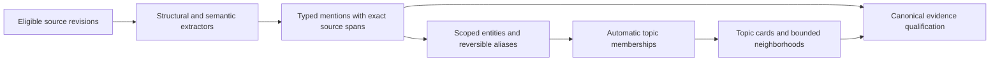

# Automatic entity mapping, topics and usable graphs

Status: approved for implementation; staged work in progress, successor features not yet delivered
Observed: 2026-10-09 (Europe/Stockholm)
Confidence: source-verified design comparison; separate local implementation/prototype evidence below, normal-runtime acceptance open
Owner: graph intelligence, with evidence and memory lifecycle dependencies

Implementation authorization: the user requested the full dedicated plan on
2026-10-09. Stage 0 is owned by the active
[concurrent preparation pack](../roadmap/execution/active/graph-concurrent-preparation.md).
The full entity/alias/topic/navigation/invalidation objective remains active;
completion of the prerequisite alone will not complete this plan.

The user's subsequent instruction requires product implementation in Rust.
The Python GLiNER prototype remains development evidence. It does not select a
mandatory Python service: candidate validation, identities, grouping,
invalidation and serving belong in Rust. An extractor/provider adapter must
retain the existing policy boundary and pass the fixture gates before selection.
The [Rust Analyzer/Graft developer integration](../contracts/rust-semantic-developer-navigation.md)
supports implementation navigation; it does not implement Brain entities/topics.

The [implementation progress and second two-agent review](../mappings/automatic-knowledge-mapping-progress-2026-10-09.md)
record local graph preparation, native regression results and a standalone
GLiNER development run. Rust candidate parsing and persisted staging now have
native direct-source privacy/restore proof, and the 10k capture test passes.
The raw extractor failed the precision/recall gates; automatic qualified entities,
alias decisions and topics remain in progress. Historical statements
about the read-only study below describe that study, not subsequent installations.

## Recommendation

Recollect needs an automatic semantic organization layer: stable entities,
source-linked relationships and readable topic groups. It already has a graph
database, native clustering algorithms and a renderer. Installing another graph
package would not supply that missing product behavior by itself.

Keep PostgreSQL/Rust as the canonical boundary and Neo4j/GDS as the graph engine.
Prototype standalone GLiNER2.5 for local extraction, reuse Cognee's entity/chunk
organization and extraction-derived summary patterns, and reuse established
grouping algorithms. Compare Graphify with Enola on repository extraction before
choosing another adapter. Graphiti is a later candidate for temporal relationships
and entity resolution, rather than the first dependency to introduce.

This refines the [broader improvement proposal](memory-product-improvement-plan-2026-10-08.md#product-behavior-we-should-aim-for).
It does not replace accepted contracts or claim a benchmark improvement. The
[first-batch proof](../mappings/memory-quality-first-batch-proof-2026-10-08.md)
still records incomplete graph performance acceptance and no new comparable
LongMemEval score. The earlier benchmark cannot establish that missing topics
caused its answer failures; organization and answer quality need separate tests.

## What we have and what is missing

| Feature | Source-verified state | Consequence |
| --- | --- | --- |
| Automatic capture and learning | Sources are processed under Brain policy into supported subject/predicate/value claims | Automatic learning exists; it does not automatically resolve semantic entities or create topics |
| Cross-session reuse | Normalized exact assertion families can reuse or replace eligible machine-maintained claims | Useful deduplication exists, but aliases such as different names for one system require additional resolution |
| Knowledge graph | Claims connect to source versions, repository facts, manifests and contributions | The graph mainly explains evidence provenance; claim subjects/objects remain text |
| Collections, areas and environments | Stable overlapping views with explicit source memberships | Automatic machine-derived topics and memberships are absent |
| Native analytics | GDS PageRank, Leiden and WCC are queued report operations | Communities describe selected connectivity, not automatic semantic topics |
| Developer CodeGraph | Local symbols, callers and impact index; includes the research checkout | Helps agents navigate code; it is separate from the product's Brain graph |
| Product code/configuration extraction | Enola produces immutable repository publication facts | A structural graph producer already exists; another producer needs a measured benefit |

Local evidence: [learning schema](../../crates/server/src/learning.rs),
[exact-family reconciliation contract](../contracts/memory-cross-session-reconciliation.md),
[knowledge descriptor construction](../../crates/server/src/graph/descriptor.rs),
[group APIs](../../crates/server/src/evidence.rs),
[native analytics](../../crates/server/src/graph/analytics/native.rs),
[analytics UI](../../web/src/AnalyticsPanel.tsx),
[CodeGraph contract](../contracts/local-codegraph-navigation.md) and
[repository extraction](../../crates/agent/src/publication.rs).

The [analytics contract](../contracts/graph-analytics.md) currently permits only
support/contribution edges for knowledge analysis, excludes inferred/similarity
edges, and makes community IDs report-local. More frequent Leiden runs would
still cluster provenance rather than discover topics. A new, separately declared
semantic grouping recipe and persisted topic identities are required.

## What the open-source projects actually provide

### Cognee: strongest organization patterns to reuse

Current upstream was inspected at
`0ec7a9fa61c9ff04bf7e02e0d57af363a993a5e1` (2026-10-08). The local reference
checkout is an older September snapshot; conclusions below use current source.

- Cognify builds entities, types and relations from document chunks. Its
  [extraction pipeline](https://github.com/topoteretes/cognee/blob/0ec7a9fa61c9ff04bf7e02e0d57af363a993a5e1/cognee/tasks/graph/extract_graph_and_summarize.py)
  accepts `summary_method="from_extraction"`: summaries can reuse extracted
  information without a second generative call. The default `"llm"` path still
  performs separate summarization.
- [NodeSets](https://github.com/topoteretes/cognee/blob/0ec7a9fa61c9ff04bf7e02e0d57af363a993a5e1/cognee/tasks/documents/classify_documents.py)
  are supplied tags from `external_metadata.node_set`; they are not automatically
  discovered topics.
- [Global-context indexing](https://github.com/topoteretes/cognee/blob/0ec7a9fa61c9ff04bf7e02e0d57af363a993a5e1/cognee/api/v1/improve/improve.py)
  is opt-in. Its [pipeline](https://github.com/topoteretes/cognee/blob/0ec7a9fa61c9ff04bf7e02e0d57af363a993a5e1/cognee/memify_pipelines/global_context_index.py)
  defaults to vector buckets; the graph-based strategy is explicitly experimental.
  [Entity-overlap scoring](https://github.com/topoteretes/cognee/blob/0ec7a9fa61c9ff04bf7e02e0d57af363a993a5e1/cognee/tasks/memify/global_context_index/bucketing/graph/scoring.py)
  uses inverse-frequency weighting and Jaccard similarity. The design offers
  bounded bucket sizes and incremental placement; whole-dataset loading and
  compute still need profiling. Its usefulness on our corpus is unmeasured.
- [Entity consolidation](https://github.com/topoteretes/cognee/blob/0ec7a9fa61c9ff04bf7e02e0d57af363a993a5e1/cognee/tasks/memify/consolidate_entities.py)
  redirects edges and removes duplicates. Recollect should borrow candidate
  matching ideas while retaining reversible aliases and original supporting
  mentions. Similar names alone must not collapse separate environments.

Current Cognee also has a [local GLiNER demo](https://github.com/topoteretes/cognee/blob/0ec7a9fa61c9ff04bf7e02e0d57af363a993a5e1/examples/guides/gliner_demo_llm_free_cognify.py).
It extracts with bounded schemas and deterministic summaries; embeddings remain
a separate operation. Cognee labels this bundled extractor a demo and distinguishes
its separately licensed production offering. We should evaluate independently
licensed GLiNER rather than assume the demo is the production pipeline.
The inspected [Cognee core license](https://github.com/topoteretes/cognee/blob/0ec7a9fa61c9ff04bf7e02e0d57af363a993a5e1/LICENSE)
is Apache-2.0; that does not confer rights to separate enterprise components.

### GLiNER2.5: first local extraction candidate

The [standalone library](https://github.com/fastino-ai/GLiNER2) and
[base model](https://huggingface.co/fastino/gliner2.5-base-v1) are Apache-2.0.
The 194M-parameter English base model supports entity spans, classification,
structured extraction and relations. Local CPU/MPS inference requires no paid
API. It takes an explicit schema; it does not independently invent an unlimited
ontology. Domain recall and multilingual behavior need fixture proof.

Proposed seam: a bounded local extractor returns candidates with exact spans,
confidence, model revision and schema version to Rust. Rust validates input
identity and publishes eligible derived navigation records. No package or model
was installed or run in this study. AMD/ROCm compatibility and the user's LAN
deployment have not been verified; CPU is the first portability baseline.

### Graphify: useful structural producer and navigation patterns

Inspected release 0.9.82 at
`5b74d7d74911cf435c8f1636b6f96ea202cc6246` (2026-10-09). The current
[NOTICE](https://github.com/Graphify-Labs/graphify/blob/5b74d7d74911cf435c8f1636b6f96ea202cc6246/NOTICE)
records Apache-2.0 and retained MIT rights for earlier contributions.

Its code pipeline can produce AST/code relationships without an LLM or
embeddings. The optional document pass has an
[OpenAI-compatible backend](https://github.com/Graphify-Labs/graphify/blob/5b74d7d74911cf435c8f1636b6f96ea202cc6246/graphify/llm.py)
that supports llama.cpp; our Qwen endpoint would still need compatibility proof
and Recollect-owned retry/budget limits.

Reuse candidates include [deterministic community labels and identity matching](https://github.com/Graphify-Labs/graphify/blob/5b74d7d74911cf435c8f1636b6f96ea202cc6246/graphify/cluster.py)
and a [versioned JSON export](https://github.com/Graphify-Labs/graphify/blob/5b74d7d74911cf435c8f1636b6f96ea202cc6246/graphify/export.py).
Evaluate that JSON through an immutable Recollect import adapter. Direct Neo4j
export lacks our canonical qualification and Brain identity semantics.
[Deduplication](https://github.com/Graphify-Labs/graphify/blob/5b74d7d74911cf435c8f1636b6f96ea202cc6246/graphify/dedup.py)
protects code identities but fuzzy non-code matching still needs stronger scope
rules. Its serving cache does not remove Recollect's PostgreSQL lock contention.

### Graphiti: later temporal/entity-resolution comparison

Inspected main at `1026ae7ae25e7e4cfcc1c7ebe00347b8a90f52a0` (2026-10-09).
[Graphiti](https://github.com/getzep/graphiti/tree/1026ae7ae25e7e4cfcc1c7ebe00347b8a90f52a0)
is Apache-2.0 and supplies incremental episodes, scoped entity matching and
temporal relationship patterns. Its
[public implementation](https://github.com/getzep/graphiti/blob/1026ae7ae25e7e4cfcc1c7ebe00347b8a90f52a0/graphiti_core/graphiti.py)
defaults to OpenAI clients; community updates are not automatically enabled
for every episode. Full ingestion involves several extraction/resolution stages,
embeddings and optional generated community summaries.

The [GLiNER example](https://github.com/getzep/graphiti/blob/1026ae7ae25e7e4cfcc1c7ebe00347b8a90f52a0/examples/gliner2/README.md)
is an experimental hybrid: local NER replaces part of the pipeline, while an
LLM still handles other operations. It is not proof of a fully free memory
pipeline. Compare it later if our temporal/entity fixtures expose a need.

## Intended automatic product behavior

Importing two permitted documents about certificate renewal and Vault should
create source-linked mentions of Vault, PKI and the explicit environment. The
app should place those documents in an automatic overlapping topic such as
“PKI / Certificates,” explain the grouping and offer a small entity neighborhood.
DEV and PROD instances remain distinct; a shared technology concept may connect
both without equating their operational state.

Routine processing remains automatic within existing permissions and budgets.
Users may rename, pin, exclude or split groups when useful. A mention is evidence
that a source discusses something; it is not proof that a system is deployed,
healthy or currently configured that way. Relations presented as assertions must
link to eligible claim revisions/support, with inferred navigation separately
identified. Topic membership does not grant access.

## Implementation sequence

| Stage | Concrete outcome | Reuse and implementation seam | Required decisions before product code |
| --- | --- | --- | --- |
| 0. Graph availability | Populated overview/neighborhood reads work during capture, audits and rebuilds | Profile `graph/read.rs`, `graph/work.rs`, `graph/queue.rs` and `db.rs`; expensive preparation outside long locks, short checked publication | Consistent snapshot, authority/epoch/deadline checks and invalidation guarantees; current first-batch acceptance stays open |
| 1. Entity mentions | Automatically map explicit claim subjects, repository metadata and document entities to typed source-linked mentions | Existing learning output plus optional local GLiNER; deterministic import adapter | Model/schema version, exact span coordinates, coverage, failures and supported languages |
| 2. Scoped entity resolution | Stable entity IDs and reversible aliases; preserve ambiguous matches | Exact scoped identities first; reuse tested library matching only for candidates | Distinguish technology concepts from actual service instances, customer/environment/repository scope, alias evidence and removal |
| 3. Automatic topics | Persist overlapping machine-derived memberships with readable names and an unassigned state | Compare eligible-vector and shared-entity grouping; established GDS/library algorithms; deterministic representative labels | Separate semantic edge recipe, weighting/exclusions, stable topic identity, invalidation and rebuild semantics |
| 4. Useful graph entry | Topic/entity cards, search seeds and small neighborhoods; connections explain why and link to evidence | Existing React/Cytoscape and bounded graph API; hydrate details on demand | Topic counts, coverage/staleness, pin/rename/exclude/split overrides, accessible loading/error states |
| 5. Optional adapters | Add Graphify or Graphiti only when equal-fixture comparison shows useful coverage/quality | Versioned JSON import or bounded candidate service; no direct canonical graph writes | Adapter ownership, source coordinates, license notices, deletions, retries and budgets |

Offline extraction/grouping proof can proceed while stage 0 is fixed. Automatic
graph expansion should not be released before the populated concurrent-read
gate passes. Neo4j import already occurs outside the descriptor transaction;
the remaining issue cannot be solved merely by moving that import again.

The first grouping baseline should need no new embedding or generative request:
use explicit metadata, eligible existing vectors where available, and resolved
entity overlap. Compare established grouping methods rather than write another
clustering engine. Missing vectors/entities remain visible as incomplete
coverage. Labels can come from representative source-backed terms; polished
summaries may reuse extraction output instead of another model pass.

Persist automatic assignments separately from human collections. The current
source-organize endpoint replaces all memberships, so using it for automatic
recomputation would destroy user choices. Match changed groups to stable topic
IDs, invalidate descriptions when contributors change, and avoid assigning
GDS report-local community numbers as persistent identity.

Leiden assigns one community per node for a recipe. Overlapping topics therefore
need multi-label entity/metadata associations or another declared grouping method
alongside those communities. Retain merge/split lineage and persistent user
overrides. New groups and representative names are created from extracted source
terms automatically; users need not pre-create every topic.

Recompute affected artifacts after source updates, correction, erasure, scope
change or model/schema change. Incremental indexes are an optimization: rebuild
must reproduce the permitted view, and stale work cannot resurrect erased data.
Derived labels/counts are hydrated through the canonical boundary, consistent
with [ADR 0007](../adr/0007-canonical-graph-projections.md).

The source coordinate contract must use half-open UTF-8 byte offsets. Local
Python character offsets require explicit conversion and byte-for-byte
revalidation against the exact immutable input; test Unicode prefixes. A
paraphrased claim subject has a claim-field origin, not an invented source span.
New semantic node types need their own canonical protocol/qualification rather
than fake claims or unchecked Neo4j labels. Extend exact privacy dependency
closure, physical cleanup and restore-journal replay as well as invalidation;
entities with remaining independent support survive with recomputed derivatives.

## Cheap acceptance tests

Use 40 synthetic/public engineering documents plus one owned toy repository.
Include unrelated documents, overlapping subjects, contradictory revisions,
aliases, identical DEV/PROD names, sibling repositories and mixed languages.
Freeze manually specified entities, spans, relations and topic pairs before
tuning. Keep a small untouched subset for final evaluation; do not use the
existing frozen LongMemEval holdout as topic-development data.

Run concurrent learning/audit fixtures with fake or deterministic local provider
outputs and external transmission disabled in the disposable test installation.
Assert zero paid/external model requests, including graph readers and background
jobs. This fixture setup does not alter the normal app's standing model policies.

| Test | What it catches | Scoring and cost |
| --- | --- | --- |
| Mention extraction and endpoint resolution | Missing entities, invalid spans, relations with absent endpoints | Exact-span/type precision and recall against frozen annotations; local model inference, $0 paid API |
| Alias and scope controls | False merges across customers, environments, people or versions | Exact expected identity/alias sets; deterministic, no LLM judge |
| Topic usefulness | Irrelevant groups, excessive unassigned sources, lost overlap | Source-topic precision/recall and pairwise grouping scores; brief blind human check of labels |
| Import/rebuild stability | Duplicate nodes, unstable IDs, changed manual groups | Repeat/import idempotency, fingerprint and membership comparison; no model call |
| Correction/erasure/invalidation | Removed content still influences labels, counts or associations | Change/remove a contributor and compare the entire affected derived view; no LLM judge |
| Interactive performance | Lock contention or whole-graph loading hidden by tiny fixtures | Populated 10k-node fixture, concurrent capture/audit/rebuild, separate lock/SQL/Neo4j/total timings |
| Navigation task | Attractive grouping that does not help a user find evidence | Find two related cross-session documents, switch scope and open exact supporting lines; timed browser task |

Proposed initial gates, not measured results: at least 95% entity/relation
precision and 80% recall on supported English domain fixtures, zero false
cross-scope identity merges, no stale/erased contributors and unchanged manual
memberships. For annotated in-scope topic sources, target at least 80% assignment
coverage; report genuinely unrelated/unassigned sources separately. Freeze the
label rubric before tuning: readable source-backed name, scope distinction and
an explanation linking the contributing documents. Set grouping thresholds using
the development subset; compare with metadata-only and current provenance-community
baselines on the untouched subset. Retain failures and unsupported languages in
the report rather than remove difficult cases from the denominator.

For performance, aim for p95 bounded reads below two seconds on the test machine
under sustained background work. Record dataset, hardware, concurrency and
coverage, and require zero graph-busy/database/timeout failures at the declared
concurrency. Count every requested read in the outcome report; latency from only
successful requests is insufficient. This is a proposed target, not a capacity
promise. Opening the graph
must not require downloading/hydrating all 10k nodes. The existing normal-Brain
timeout remains a required real-runtime check beyond synthetic success.

Answer-quality evaluation follows separately after navigation proves useful.
Use deterministic question/citation fixtures first, then a bounded comparable
benchmark only within a separately available budget. This research ran no paid
extraction, embedding, answer or judge calls.

## Cost and deployment boundaries

- The proposed offline fixture proof uses **$0 paid API calls**. Local extraction
  and graph computation consume machine time, memory and electricity.
- GLiNER is an extractor, not an embedder or full conversational model. Existing
  eligible vectors can be reused; new cloud embeddings keep their normal cost.
- The user's Linux llama.cpp/Qwen server may supply optional semantic extraction
  through a compatible adapter. We have not verified that endpoint or its JSON,
  throughput or relation quality. A CPU/MPS extractor on the Mac is another
  candidate and does not require occupying the 24 GB AMD GPU.
- A local Python extractor is a proposed optional component. The accepted GDS
  analytics contract excludes Python from its current implementation; this
  proposal does not silently change that contract or make Cognee mandatory.
- No package installs, model downloads, reference edits, deployments, commits,
  provider selection changes or new benchmark claims occurred in this study.

## Ownership, source method and outstanding proof

Two requested agents performed complementary read-only audits: one inspected
Recollect's actual automatic processing, graph shape, grouping and locking; the
other inspected current Cognee/Graphify source, licenses and integration seams.
The coordinator checked Graphiti/GLiNER primary sources and reconciled their
findings. Context7 resolved Cognee, Graphify and Graphiti. A guessed Graphiti
help URL and a guessed Cognee stage file failed; primary repository source and
explicit pipeline files supplied the evidence instead.

Atlas supports [evidence before belief](../../references/agent-memory-atlas/content/patterns/evidence-before-belief.md)
and [scope-aware identities](../../references/agent-memory-atlas/content/patterns/scope-as-a-first-class-key.md).
It is design evidence; older system reports are not current package proof.

The graph epic owns derived entities/topics/navigation. Evidence owns source and
manual grouping semantics; memory lifecycle owns correction and erasure effects.
Detailed entity/alias/topic contracts are still needed (`needs-contract`), as is
product protocol and qualification for the new semantic node kinds. The accepted
[concurrent preparation contract](../contracts/graph-concurrent-preparation.md)
now governs the graph read/publication prerequisite; normal-runtime acceptance
has not passed.
An optional Python extraction service also needs an explicit adapter/runtime
decision (`needs-adr`); it does not replace native GDS or become a mandatory
Cognee runtime through this proposal.
Create decision-complete successor slices/packs before implementing these schema
and cross-module changes. This research document itself is not an execution pack.

Unproved: local model domain recall, multilingual coverage, actual Mac/AMD
inference throughput, candidate adapter compatibility, semantic-topic usefulness,
Graphify coverage gains over Enola, and any answer-score improvement. Those are
the specific reasons for the small fixture comparison and staged gates above.

Validation: `./scripts/validate.sh` passed governance lint, 32 governance tests,
the zero-provider-call support corpus check and 10 baseline tests. `git diff
--check` passed; both agents reviewed this proposal and their corrections were
incorporated. All three reference checkouts remained clean. These checks do not
establish new product runtime acceptance. Version: N/A (research only).
Commit: uncommitted.
