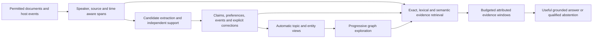

# Recollect product improvement plan

Status: proposed; larger phases not implemented; bounded first-batch follow-up below
Updated: 2026-10-08
Scope: memory quality, automatic learning, retrieval, graphs, organization,
performance, reliability, user experience and evaluation.

## Recommendation

Fix evidence delivery and large-graph access first, measure the existing automatic
memory pipeline, then add supported temporal/entity memory and automatic topic
organization. Keep the independent Rust product, PostgreSQL/pgvector and Neo4j.
A larger answer model or a different graph renderer would leave the demonstrated
bottlenecks in place.

The target is a materially more useful app: answers contain the needed evidence,
remember explicit changes, use preferences, and stay appropriately grounded;
large Brains open a useful graph immediately; sources organize automatically;
ordinary capture and learning run without manual record maintenance. Every
claimed improvement must pass a frozen comparison and the existing scope,
correction, privacy, erasure and execution-authority controls.

This is a dedicated proposal responding to the requested two-agent investigation.
It does not authorize itself as an implementation contract. Existing shipped
features are retained; unresolved design changes are listed before their
implementation routes. No product code, normal deployment or reference checkout
was changed, and no paid model calls were dispatched by this investigation.

## Evidence and current state

Two agents independently audited the memory/answer pipeline and the graph,
organization, scaling and Cognee implementation. The parent reconciled their
findings with current source, accepted foundations/contracts, the completed
[benchmark report](../mappings/openrouter-benchmark-proof-2026-10-08.md), and actual
read-only calls to the normal installation. CodeGraph was current; ambiguous
relationships were verified in source. Agent audit receipts are retained under
`.cache/graph-cognee-audit.md` and the task's two-agent messages.

### What the benchmark says

- All 50 LongMemEval questions eventually received completed answers; **20/50
  were correct**. All eight unanswerable questions were correct, so answerable
  accuracy was only **12/42 (28.57%)**.
- **23 of the 30 wrong answers retrieved all required supporting sessions**.
  Retrieving the conversation is insufficient when the useful sentence is absent
  from the actual model input.
- All 50 calls reported fragment truncation and context-budget coverage. Fifteen
  of the 42 answerable questions produced no factual statements. Two English
  questions received substantial Chinese responses despite an existing language
  instruction.
- Qwen achieved 99% supporting-document recall on the 491-document HotpotQA
  sample, equal to Cognee's native vector lane. This does not prove the embedder
  is optimal, but it does not support replacing it as the first fix.
- Original C had 27 rate limits and one ingestion rejection. Explicit recovery
  obtained the missing answers, but first-pass availability remains a separate
  weakness. Earlier uncertain calls and unknown bills remain retained.
- GLM 4.7 failed the support-safety diagnostic with three critical false-usable
  admissions. GLM 5.3 had none observed in the small held-out diagnostic, but one
  assessment was unavailable. Cheap answering and safe autonomous acceptance
  need independent evidence.

### Does disabling automatic learning explain the poor score?

**It may explain part of it; we have not measured the effect.** The experiment
intentionally disabled extraction and learning and used imported raw histories.
Supported compact facts, explicit corrections and preferences could reduce the
amount of irrelevant conversation in context. They could also lose information,
create duplicate families or accept an unsupported interpretation. An ON/OFF
comparison is necessary.

There are separate paths to test:

1. Plain document import plus extraction/support/reconciliation produces learned
   claims, with raw evidence available as fallback.
2. Authenticated host capture plus settled sessions can additionally produce
   session digests and lineage-based continuation. Flipping learning on for plain
   document imports does **not** exercise this path.
3. Actual plugin context delivery has its own existing deadline and byte budget;
   it needs host acceptance beyond a successful Ask API experiment.

Existing native automatic-memory features are implemented in repository commit
`27bbd00`: independent support checks/staging, session digests, scoped briefs,
continuation and bounded cross-session reconciliation. Do not implement those
features again under new names.

**The running normal installation is behind that implementation.** Its migration
head is `035_plugin_workflow`; current repository migrations 036–040 and the
OpenRouter working-tree migration 041 are absent there. Older automatic learning
is enabled in the DLAG/SWEG Brains under OpenAI, but this does not mean the newer
support/digest/brief implementation is deployed. `/health/ready` reports readiness
for the older executable. Installed native-host/plugin versions still need a
separate inventory. This is a deployment gap, distinct from the benchmark's
explicit learning-OFF configuration.

### Reproduced graph problem

The ready normal DLAG knowledge graph has **1,230 nodes and 1,065 edges**.
Read-only API observations:

| Request | Result | Elapsed | Delivered |
| --- | --- | ---: | --- |
| Entity view, offset 0 | HTTP 200 | 4.474 s | 100 entities |
| Complete overview, no center | HTTP 422 `graph_display_too_large` | 3.928 s | No graph |
| Centered, one hop | HTTP 200 | 3.976 s | Two nodes / one edge |

The specific failure occurs at the server's **500-node / 2,000-edge display
limit**, before rendering. A graph can be ready while its full overview cannot
be displayed. Existing code first selects/qualifies the entire graph even for a
centered request; it verifies all selected physical records before restricting
the neighborhood. Two nodes can therefore cost almost as much as the full view.
The internal ceiling is 5,000 candidate representations / 20,000 edges; source
chunks are counted before graph-identity deduplication. A centered request cannot
escape that initial ceiling. This is not evidence that the GPU or Cytoscape
caused the reproduced failure.

The graph page also chains view hydration into exploration, and entity-page
polling repeats full reads. These are code-backed risks; the four-second API
delay has not yet been apportioned between canonical SQL, artifact checks,
Neo4j verification and transport. Browser layout is a separate, unprofiled stage.
Raw proof is
`.cache/product-improvement-runtime-2026-10-08.json`.

### What we already have, and what we do not

| Capability | Current implementation | Gap to address |
| --- | --- | --- |
| Collections / areas / environments | Stable overlapping source associations, existing API/UI | No automatic semantic topic-assignment worker found |
| Automatic memory | Extraction, support, revisions, digests, brief/continuation | Newer implementation not on normal runtime; full public-history ablation absent |
| Temporal memory | Canonical fact/knowledge-time fields and filtering | Automatic extraction currently populates unknown validity; relative events need typed handling |
| Entity reconciliation | Exact normalized subject/predicate family matching | Aliases/paraphrases can remain separate; no general safe entity-resolution layer |
| Knowledge graph | Claim/support and handover/contribution provenance | Rich semantic entity relationships and topical navigation are not projected |
| Repository graph | Exact snapshot structural relationships | Large-scope access currently requires too much whole-selection work |
| Graph analytics | Native Neo4j GDS PageRank, Leiden, WCC | Communities are connectivity groups, not automatically labeled topics |
| Graph UI | Cytoscape 2D with selection/layout/path controls | Large Brain entry fails instead of offering a useful progressive view |
| Semantic retrieval | Exact eligible pgvector baseline | 5,000 scoped representation scan and 50,000-entry index ceiling; no ANN scale proof |
| Provider / operations | Governed model gateway, durable requests, budgets | Availability, unknown bills, stage latency and worker fairness need measured acceptance |

## Cognee: useful ideas and comparison limits

The inspected benchmark/reference is **Cognee 1.5.4**, commit
`c0d18c80e24b7b78918e7642c03f6f128fdd2aee`. Current official documentation was
checked on October 8 and includes newer APIs; it is not a substitute for that
version's source behavior.

| Cognee mechanism | What it actually does | Recollect implication |
| --- | --- | --- |
| Dataset | Caller-selected ingestion/processing/access grouping | Our collections cover much of this organization role; a dataset is not automatically a discovered topic |
| NodeSet | Caller-supplied graph grouping/tag, propagated as links | Our explicit groups exist; automatic derived topics are a separate missing feature |
| `cognify` | Splits token chunks, extracts entities/relationships and summaries, stores graph/vector representations | Reuse the design idea of semantic entities and summaries with Recollect's support/authority lifecycle |
| `memify` | Configurable enrichment runner; pinned default is config-dependent triplet/vector indexing | Do not assume every consolidation, feedback or temporal feature runs automatically by default |
| Optional Global Context Index | Groups summaries into semantic buckets and higher-level summaries | Useful orientation idea; summary hierarchies are lossy and require deletion/support rules |
| Graph visualization | Bounded seed neighborhoods, usually depth two / up to 500 nodes | Adopt query/seed-first exploration, while improving its expensive whole-graph fallback |
| Renderer | D3 v7 canvas/SVG views | Recollect uses Cytoscape 2D; bounded server reads take priority over changing the renderer |
| Semantic map | Embeddings, PCA/optional UMAP and full-dimensional k-means; capped/sampled at 2,000 | A topic map is not dataset assignment, truth or authorization |

Primary sources: [Datasets](https://docs.cognee.ai/core-concepts/further-concepts/datasets),
[NodeSets](https://docs.cognee.ai/core-concepts/further-concepts/node-sets),
[Cognify](https://docs.cognee.ai/core-concepts/main-operations/legacy-operations/cognify),
[Memify](https://docs.cognee.ai/core-concepts/main-operations/legacy-operations/memify),
[Global Context Index](https://docs.cognee.ai/core-concepts/further-concepts/global-context-index),
and [pinned visualization source](https://github.com/topoteretes/cognee/blob/c0d18c80e24b7b78918e7642c03f6f128fdd2aee/cognee/modules/visualization/subgraph_data.py).

Cognee's no-query highest-degree visualization fallback still loads the whole
graph. Some semantic-map vector adapters can re-embed during rendering if vectors
cannot be fetched. We should avoid both patterns. Its pinned provenance and
contradiction features are optional, not proof of safe current-state handling.

Our completed comparison establishes equal **small-corpus vector retrieval**.
Cognee's vector lane was faster end to end, but it used whole passages/LanceDB
and different transport/governance. Provider query-embedding latency is included.
The full Cognee graph attempt stopped on an uncertain timeout; there is **no
Cognee LongMemEval or complete-agent superiority result**. Richer graphs and
summaries are plausible improvements to evaluate, not an explanation already
proved by this campaign.

## Product behavior we should aim for

All derived views remain projections of one canonical authority. Original source
versions, scope, permissions, fact/knowledge time and erasure apply throughout.
Topic membership and graph proximity never grant execution or prove a claim.

The ordinary user imports/connects once and uses the coding host normally. They
should see meaningful progress, a useful answer or a specific recoverable limit.
They should not have to tune each retrieval count, assign every topic, approve
every claim, restart services to recover routine work, or manage hidden task
inventory. Keep inspection and correction available without a required review
inbox or a new large settings form.

## Proposed sequence and acceptance gates

These are **targets and implementation proposals**, not measured future results.
Runtime alignment, evidence delivery and graph entry are the first work batch;
subsequent paid experiments depend on its measurements. Each significant change
needs an owning slice and decision-complete pack under the existing lifecycle.

### 0. Align runtime and make the pipeline measurable

Record actual revision/build, migration head, installed plugin/host versions,
provider/policy and worker lanes. Prove the current repository in an isolated
owned runtime first. A later normal upgrade must preserve inventory, verify
backup/restore and exercise migrations plus the installed native host. Do not
silently deploy OpenRouter or switch the existing Brain's provider.

Add metadata-only timings and counts for import, queue wait, processing,
extraction, support, embedding, eligibility, artifact reads, graph verification,
packing, answer-provider wait and rendering. Record no customer question/source
text in operational logs. Show current pipeline coverage, failure category,
budget pause, unavailable artifact and write-to-readable lag in existing health
and activity views. Capture/source permissions and model-transmission permissions
remain distinct.

Acceptance:

- Every experiment records the actual path and migration/model/policy state;
  learning ON means the worker produced eligible, supported records.
- A public synthetic session exercises capture → extraction → independent support
  → canonical memory → recall, including restart and denied-transmission controls.
- Stage timings distinguish provider time from server/DB/UI computation; billing
  receipts, reservations and retries are accounted separately.
- The older running inventory is preserved; current healthy status is never
  presented as proof that later migrations/features are installed.

### 1. Deliver the answer-bearing spans

Source processing currently creates up-to-4,096-byte chunks, while recalled
fragments are clipped to 2,048 bytes. Semantic ranking keeps one fragment per
source identity and can replace a lexical fragment while clearing alternatives.
Fix these seams together rather than merely increasing the clipping constant.

Use speaker/date-aware turns or paragraph windows where possible, retaining exact
original byte/line coordinates. Separate the scoring representation from the
chosen delivered span. Preserve several needed nonduplicate windows from one
canonical source within the existing **16 KiB Ask budget**. Prefer complete
answer-bearing turns and bounded neighboring context; do not include a whole
session just because one vector matches it. Preserve source diversity without
making it prohibit two relevant spans from one session. Revalidate every exact
span at answer publication, including privacy/rejection/expiry races.

Acceptance:

- Gold-supporting text near byte 2,049, at chunk boundaries and in later user turns
  reaches context; explicit old/new statements and multiple facts from one source
  are represented correctly.
- Evaluate **delivered answer-span coverage**, not only session recall. Show
  dropped spans/reasons and complete serialized attribution bytes.
- No increase to the initial total context budget; a separate budget sweep may
  follow after comparing span selection at 8/16/32 KiB where the caller allows it.
- Same-source erasure, cross-Brain/scope canaries, original-class permissions,
  duplicate evidence and final-bundle revalidation remain correct.

Primary seams: `evidence.rs`, `retrieval.rs`, `retrieval/semantic.rs`,
`retrieval/context.rs`, `retrieval/answer_bundle.rs`, shared recall/citation types.

### 2. Make large graphs useful immediately

Split **metadata/overview/search**, **bounded neighborhood discovery** and
**exact evidence hydration**. Do not require a complete `/graph/view` success to
open a small neighborhood. Count unique visible entities separately from source
chunks. Use small parameterized native queries for seeds, neighbors and exact
selected records, without whole-descriptor/source hydration for each page.

Initial entry should present counts and a useful bounded grouped overview or
seed choices. Group by existing repositories/collections/source families first;
these require no LLM. Search for an entity, open Ask citations in the graph,
expand one hop, and offer explicit continuation for omitted neighbors. Large hubs
need edge-family limits and summary/count views. Isolates remain discoverable.
A partial view is clearly partial and cannot establish that no path exists.

Remove duplicate initial full reads and three-second full-page polling. Batch
artifact/provenance checks. Consider fenced verification caching only after stage
profiling: key it by Brain/access context, exact selection/manifest, generation,
privacy/authority epoch and retention deadline, with final revalidation. Never
post-filter a forbidden path after native traversal; forbidden intermediate nodes
must not hide a valid authorized route.

Acceptance targets:

- Existing DLAG graph opens a useful default view, at most 250 nodes / 1,000 edges,
  without the current 422 dead end; warm API p95 under two seconds and browser
  interaction ready under three seconds on the measured machine.
- Two-node neighborhoods avoid full-graph hydration/verification. Entity paging
  does not perform whole-selection work for every 100-row page.
- After the reader contract is extended, a local **100k-node / 500k-edge** fixture
  supports bounded search/one-hop exploration without whole-graph transport.
  This is a future test target, not a claim the current projection can ingest it.
- Test hubs, cycles, isolates, parallel edges, stale generation, revoked grants,
  erased intermediates, expired supports and cancellation of late UI responses.
- Ordinary rendering dispatches zero model calls; retain Cytoscape/native Neo4j
  unless profiling justifies another renderer. Keep the current light design and
  independent visual review for the delivered UI.

Primary seams: `graph/read.rs`, `graph/exploration.rs`, `graph/adapter.rs`,
`retrieval/graph.rs`, `GraphPanel.tsx`, `GraphExplorer.tsx`, `GraphCanvas.tsx`.
Current complete-overview/refusal semantics need an explicit contract amendment;
silently truncating the response would violate them.

### 3. Make the answer useful without weakening grounding

Use identical saved bundles to separate answer behavior from retrieval quality.
Define three clear behaviors inside the existing read-only Ask:

- Historical/user reporting: answer “You said … on …” from attributed evidence,
  without promoting that report to a verified current operational fact.
- Current-state questions: require appropriate explicit changes, applicable
  validity and support; distinguish configured, implemented, deployed and verified.
- Personalized guidance: use explicit remembered preferences/conventions to shape
  helpful advice, rather than only describing the retrieved records.

Keep uncertainty and provenance available, but omit repetitive internal coverage
commentary from ordinary answers when it does not help the user's decision. Test
language/structure compliance; the existing language instruction alone did not
prevent Chinese answers to English questions. Do not blindly spend a second model
call to repair each response. Current resource recommendations or external facts
require separately governed evidence acquisition; no new browsing/tool execution
is implied by this proposal.

Acceptance: positive historical/user-report cases answer despite unreviewed
status; operational negative controls still abstain; preference-based advice
uses the remembered information; English questions receive English answers;
all factual citations remain exact and eligible. Track over-abstention and
unsupported statements separately. Ask does not learn from its own generated
answer or grant tools/execution.

### 4. Measure and complete automatic learning, time and corrections

First compare raw evidence retrieval with supported learned claims plus raw
fallback. A ten-history pilot should establish actual extraction/support cost,
coverage and queue latency. Preserve independent support checks; do not replace
verification with “the extractor seemed confident.” Measure false acceptance,
duplicate families, retained useful facts and explicit correction accuracy.

Automatic extraction currently sets fact validity to unknown, even though
canonical temporal storage exists. Add explicitly typed event/assertion time,
precision, original speaker, preferences/conventions and evidence of a change.
Resolve relative dates only against a known source utterance date, not server
receipt time. Keep fact time, source observation time and recorded knowledge time
separate. A user saying a setting is deployed is an attributed report unless
independent operational evidence establishes deployment.

Extend entity/property discovery with bounded alias candidates and evidence-based
relationship assessment. Keep exact identities, scope, environment and manifests.
Never silently merge identical names across customers, pick the newest timestamp
as truth, or overwrite protected human decisions. Ambiguous links remain qualified
without forcing a manual task. Late evidence and historical quotes need explicit
controls; they must not become current corrections accidentally.

Next exercise authenticated capture, settled-session digests, exact retained
support and continuation. Public history replay must preserve roles/session/task/
child identities and dates. A summary cannot support itself or recursively create
another excerpt/learning loop. Preserve the accepted distinction between raw
expiry and erasure: permitted independent exact support excerpts can keep memory
eligible after raw expiry; erasing the original removes its excerpts and dependent
memory. Excerpt expiry independently removes its dependent memory; without durable
support, memory becomes qualified or unavailable under the existing policy.
Superseded or withdrawn assertions must disappear from briefs and digests
before their next delivery, while eligible supported replacements remain available.

Acceptance: meaningful gain from learning ON on identical data/model/budget;
no critical false-usable result in the frozen safety controls; correct explicit
updates, relative-date arithmetic and three-event ordering; correct lineage-based
“continue”; no arbitrary newest-session selection; late uploads, crashes,
concurrent corrections and denied transmission have positive controls.

Primary seams: `learning.rs`, `autonomous.rs`, `memory_support.rs`,
`memory_support_audit.rs`, `support_excerpts.rs`,
`session_digests.rs`, `memory_rules.rs`, `retrieval/brief.rs`, plugin capture/recall.
Existing functionality is exercised and refined, not reimplemented. The actual
plugin retains its established 8 KiB framing/deadline; the API ablation can retain
16 KiB to isolate learning. Record those as separate delivery paths.

### 5. Organize sources and concepts automatically

Retain collections, areas and environments as stable explicit views. Add
**derived topic views and assignments** under standing Brain policy, including
sources, claims, sessions and repositories. Use existing vectors and explicit
metadata before adding labeling calls. Support overlapping topics, useful names,
stable topic IDs, assignment reasons, low-confidence unassigned state and rename/
pin/exclude overrides that survive rebuilds. Routine classification runs in the
background; every source does not need a user to tag it.

Group semantics must be explicit: GDS Leiden describes graph connectivity;
semantic topics require content-aware grouping. Cluster full-dimensional eligible
vectors, using an established algorithm/library after measurement. Any 2D embedding
projection is presentation only. Label or summarize changed groups asynchronously
and once per changed input version; rendering reuses existing projections/vectors
and never re-embeds the graph just to draw it.

The first topic card should derive directly from eligible original claims/spans,
with bounded support and visible coverage. Do not introduce Cognee's recursive
summary hierarchy into our accepted digest flow or use summaries as independent
corroboration. A hierarchy is a separate later design only if measured useful.

Freeze source-topic relevance gold and a label rubric before tuning, including
overlapping topics and legitimate unassigned cases. Report assignment precision,
recall and unassigned coverage separately; use source-topic pairs as the assignment
unit and one topic name/card as the label unit. Include every emitted assignment
and every eligible topic label in their respective denominators; hiding difficult
items must not improve the score.

Acceptance targets: at least 85% relevant assignments and 85% accepted labels on
those held-out engineering fixtures, with recall/coverage gates fixed before
tuning; overlapping concepts remain findable; unrelated topics and cross-Brain/
Production/Development canaries stay separate; explicit overrides survive reindex;
erasing a contributor invalidates dependent assignments/cards; unsupported topic
inference does not change authorization, canonical truth or automatic execution.
Compare retrieval quality with topics OFF/ON before treating grouping as a ranking
improvement. Inferred topics may orient users while initially leaving exact search
eligibility unchanged.

### 6. Build a supported semantic relationship view

Recollect's existing knowledge graph mainly explains where claims came from.
Keep that evidence view and the separate repository structural view. Add a
clearly typed derived **concept/entity relationship view** when support exists:
services, repositories, environments, people and concepts connected by explicit
assertions. Preserve entity aliases, support spans, original speaker, scope,
revision and fact/knowledge time. Structural extraction, model inference and
observed deployment remain visibly different.

Use this graph only for tasks it can improve: dependencies, cross-repository
questions, multi-hop evidence and conflicting/latest assertions. Fuse bounded
eligible paths with span retrieval; do not send the entire graph to the LLM.

Acceptance: evidence-backed multi-hop engineering answers improve over strong
span retrieval; every path and claim traces to exact eligible support; an erased
or forbidden intermediate cannot contribute; similar names do not merge across
scopes; stale inferred edges invalidate their summaries/answers. Benchmark graph
OFF/ON under the same context/model budgets. A larger graph alone is not success.

### 7. Scale search, ingestion and background work

Keep exact eligible-vector search as the small-scope correctness oracle. Profile
canonical SQL, embedding-provider latency, artifacts, packing and queue wait
before changing indexes. Measure 10k → 100k → later 1m synthetic representations,
with locally generated vectors so scale tests require no external model spend.
Include concurrent capture, recalls, learning and heavy graph jobs.

If ANN is justified, use Brain/profile-isolated candidates, native filtered/iterative
queries and canonical refinement with bounded oversampling. The current
MATERIALIZED exact-query shape and hard limits need redesign; adding HNSW alone
is insufficient. Preserve model/dimensions/representation compatibility, and
compare eligible top-k against exact search. Filtering after ANN can reduce hits;
iterative scans do not themselves establish scope isolation.
[Official pgvector filtering](https://github.com/pgvector/pgvector#filtering).

Batch/vectorize compatible embedding work where it preserves canonical identities,
provider limits and individual billing; this is distinct from an asynchronous
Batch API. Cache only eligible revision-bound projections/query representations
under a governed privacy/budget contract. Changed/deleted sources invalidate
all affected views. Source/event incremental processing and change-keyed topic/
summary jobs should prevent complete-history reprocessing on every import.

Use bounded worker fairness: new capture/support checks and interactive recall
must not starve behind graph analysis, audits or summaries. Backpressure is visible;
paused budgets recover under standing policy, uncertain paid calls are not blindly
repeated. Keep separate heavy-lane CPU/memory admission and scratch cleanup.

Acceptance targets: scoped ANN Recall@10 at least 0.95 versus exact eligible oracle,
zero forbidden/stale leaks, compute-only warm p95 under one second on a declared
100k-representation fixture, and no lost/duplicated capture during competing heavy
work. Report machine, cold/warm state, peak memory, database size, queue delay,
provider time and end-to-end latency separately. Confirm whether each current cap
is still reached; do not market million-passage capability from a small test.

### 8. Make reliability, costs and the app flow coherent

Keep GLM/Qwen for the initial experiments; select models per measured purpose.
GLM 4.7's observed support failures rule it out for unattended acceptance from
this evidence. A stronger verifier or local model is an optional later comparison,
not a prerequisite for fixing context or graph access. Do not automatically change
the user's existing Brain provider, create fallback chains or route private
customer evidence to a new service.

Show why a record is pending, supported, superseded or unavailable. Keep ordinary
answers concise with expandable exact evidence. Topic cards, graph search,
source history and “open this citation in the graph” should share identities and
navigation. Large source lists need server pagination/search and bounded detail
reads. Scope labels stay clear across Brain/repository/environment/manifest.
Plugin reconnect, abrupt host exit and late uploads need end-to-end proof.

Classify provider 429/503, malformed output, invalid citations, admission denial,
unknown completion and budget pause separately. Define any bounded automatic
retry in its own contract; the current Ask forbids automatic paid retries and
unapproved fallback. Keep receipts before/after recovery and never repeat a
successful answer merely to make a run look cleaner. Reconcile reported cost with
key usage, showing timestamp and unknown reservations. Privacy-safe diagnostics
should connect a visible failure to its stage without exposing source payloads.

Acceptance: useful graph/answer/source flows at normal laptop and large desktop
sizes; independent visual review and functional browser tests; no mandatory
manual tuning/approval queue; installed-host reconnect/compaction/capture works;
backup/restore plus erasure ledger prevent resurrection; two-user revocation and
customer scope controls remain correct. Resolve or explicitly contain the existing
twelve broader baseline test failures before claiming broad release readiness.

## Evaluation that can prove improvement

### Frozen data and attribution

The old 50 LongMemEval questions are diagnostic/regression data, because their
failures informed this plan. A distinct next **50-question holdout is already
frozen, unexecuted, with no overlap**. It selects the next seven answerable cases
per official task plus the next eight abstentions in file order. Its type counts
differ from the old sample (all eight next abstentions are multi-session), so
compare baseline and candidate **on this same new set**, rather than attributing
an old/new aggregate difference to the implementation.

- Pinned original dataset/evaluator revisions are those in the completed report.
- New holdout SHA-256:
  `29b527081b70d03eac90decd5e3eeaef27e535868ad24244f9f0b94b2b435c7f`.
- Local input/manifest: `.cache/product-improvement-holdout-2026-10-08/`.
- The [checked-in selection manifest](memory-product-holdout-manifest-2026-10-08.json) records IDs and counts, without
  publishing gold answers into memory. It is not an executed score.

Before implementation tuning, also freeze 50 engineering answer cases covering
configuration versus deployment, exact revisions, multi-repository scope,
correction/late evidence, conventions/preferences, procedures and hostile
recalled instructions. The existing support-verdict corpus is a separate safety
set; it is not a substitute for engineering answer gold. These engineering cases
are **not authored/executed yet**; phase 0 owns them.

### Controlled arms

| Arm | Change from preceding arm | Question answered |
| --- | --- | --- |
| A | Fixed-route raw baseline | What is first-pass quality/availability on unchanged product? |
| B | Span-aware windows/packing | Does the needed evidence reach the model? |
| C | Attributed/useful answer behavior | Does the model use identical evidence appropriately? |
| D | Extraction + independent support + reconciliation, raw fallback retained | Does automatic learned memory improve quality enough for its cost? |
| E0 | Authenticated capture + learning, without digests/brief delivery | Does faithful session capture change quality beyond plain import? |
| E1 | Same E0 inputs + digests/brief/continuation | Does compact automatic session delivery help beyond captured learning alone? |
| F | Winning arm + bounded graph, relationship cases only | Does graph structure add measurable value? |
| G | Winning arm + topics, relevant navigation/search cases | Does automatic grouping help discovery or retrieval? |

Develop arms on old diagnostic/synthetic cases. Freeze a winner/configuration;
run only baseline versus winner on the new LongMemEval and engineering holdouts.
Do not repeatedly tune on the held-out answers. Keep data, model/route, dimensions,
recall budget and question protocol constant within each comparison. A faithful
plugin test retains its existing smaller host framing/deadline separately.

Report official overall, task-averaged and abstention metrics plus per-type counts,
answerable accuracy, first-pass availability, delivered evidence coverage,
unsupported/stale/forbidden statements, over-abstention, language adherence,
cold ingestion, write-to-readable lag, compute/provider/UI latency and cost.
Repeated judge agreement measures consistency, not truth. Review concrete misses
and safety controls alongside the automated score. Retain every failure and
unknown paid outcome; eventual recovery is not first-pass reliability.

Initial go/no-go targets, explicitly proposed:

- At least **15 percentage points paired improvement** over the fresh baseline
  in LongMemEval answerable accuracy (42 fixed answerable cases) and, separately,
  engineering answer accuracy (all 50 cases under the rubric frozen in phase 0).
  Report these independently; do not pool their different rubrics into one score.
  Report overall LongMemEval accuracy across all 50, task macro and abstentions
  alongside the primary metric, with no task-type collapse hidden by the aggregate.
  Show paired win/loss counts and uncertainty; fifty questions cannot establish
  a universal superiority claim.
- No critical support/authority false admission or forbidden disclosure in the
  frozen safety controls; preserve abstention on truly unsupported cases.
- Reduce avoidable refusal on known answerable questions without inventing facts.
- Measure first-pass completion and a lower warm-latency distribution; specific
  provider-inclusive latency targets follow stage profiling rather than guessing.
- Graph and topic targets are evaluated separately; they are not assumed to cause
  the conversational answer-score gain.

### Cost and comparison budget

Planning estimates use the saved October 8 DeepInfra GLM tariff (USD 0.075/M
input, 0.25/M output) and observed Qwen/judge receipts, not a guaranteed future bill.
At 5k input/1k output tokens, fifty GLM answers are roughly USD 0.031; fifty
judgments at the campaign's average are roughly USD 0.036. Thus a small answer/
judge pilot is about **USD 0.07**, and several diagnostic arms approximately
**USD 0.30–0.60**, excluding index work, failures and unknown bills.

Full extraction plus support over all 2,402 histories may cost **USD 1–5**;
measure ten histories first, then project actual admitted tokens, candidates,
verifier output and repeated failures. Capture replay/topic summaries add their
own counted costs. Local graph, paging, lifecycle, budget, generated-vector and
UI tests require **USD 0 in model calls**; local CPU/storage/time still cost effort.

The earlier campaign retains USD 4.07071 unknown-cost reservation and about
USD 0.21783 known receipts. Under its USD 8 ceiling, that leaves approximately
USD 3.71 unreserved room before new work, not the key's displayed USD 9.86 balance.
Do not start an estimated USD 5 full-learning arm within that remaining ceiling.
Use stage caps, reconcile receipts, then adjust scope or obtain any necessary new
budget authorization only when a concrete measured next run is ready. This planning
investigation dispatched **zero additional model calls**.

For a fair future Cognee comparison, pin version, enrichment/global-index settings,
data, embedder, generator, query instruction and context budget. Compare vector,
entity/summary graph and enrichment arms separately. Complete a small bounded
graph lane before any larger run; do not blindly replay the earlier uncertain
attempt. Differences in native memory representation and authority remain explicit.

## Ownership and decisions before implementation

These are proposed slice boundaries, not new shipped epics or accepted contracts.
Use existing epic owners rather than starting a parallel product roadmap.

| Proposed slice | Owner | Authority / remaining decision |
| --- | --- | --- |
| Runtime alignment and stage tracing | Operational readiness; memory lifecycle | Existing deployment/diagnostic rules; inventory/backup/host proof before normal upgrade |
| Attributed evidence windows | Hybrid retrieval | Amend recall/citation/context and exact revalidation contract; bounded multi-span representation |
| Progressive graph entry and scalable reads | Graph intelligence; desktop experience | Amend complete-overview semantics, partial coverage, bounded discovery and physical verification |
| Useful attributed answering | Hybrid retrieval | Amend answer behavior for historical reporting and grounded personalization; no execution/tools |
| Typed event time and alias candidates | Memory lifecycle | Amend extraction/reconciliation schemas and ambiguity/override rules |
| Full automatic pipeline ablation | Operational readiness | Extend benchmark protocol for faithful capture and actual learning settlement; stage budget |
| Automatic topic views | Evidence/workspaces; memory lifecycle | New derived-assignment provenance, stable IDs, override, rebuild/erasure rules |
| Supported semantic relationships | Graph intelligence; memory lifecycle | New projection meaning and entity-resolution contract; inferred links remain distinct |
| Scoped ANN and background fairness | Hybrid retrieval; operational readiness | Exact-oracle/isolated ANN behavior, cap changes, scheduling and privacy-safe measurement |
| Reliability / UI / installed-host acceptance | Existing owning epics | Preserve defaults; any paid retry/fallback/reranker needs explicit contract |

The accepted foundation still defers learned retrieval gates, adaptive decay,
advanced reranking and automatic executable skills. This plan does not silently
implement them. Add a measured proposal only if the earlier phases leave a clear
gap. Existing local automatic-memory/source-support delivery remains historical
fact; its normal installation upgrade is a separate operation.

## First implementation batch

1. Inventory current runtime/plugin state, freeze engineering gold and add stage
   timing/evidence coverage. Validate the already-implemented memory/provider
   features in an owned faithful runtime.
2. Deliver span-aware evidence and saved-bundle answering diagnostics, keeping
   budgets and authority controls stable.
3. Deliver progressive graph entry/search and stop duplicate whole-graph reads.
4. Run the small learning/capture pilot; use its actual benefit/cost to choose the
   next phase. Temporal/alias support and automatic topics follow measured gaps.

This batch addresses demonstrated failures and gives a trustworthy basis for
larger changes. It does not spend weeks constructing more graph nodes before
users can access the graph or before measuring whether its paths help answers.

## Sources, validation and limits

Governing sources: [foundations](../foundation/README.md),
[accepted recall/answer behavior](../contracts/retrieval-answers.md),
[source support](../contracts/memory-source-support-verification.md),
[session digests](../contracts/memory-automatic-session-digests.md),
[cross-session reconciliation](../contracts/memory-cross-session-reconciliation.md),
[collections](../contracts/evidence-collections.md),
[graph exploration](../contracts/graph-exploration.md),
[graph analytics](../contracts/graph-analytics.md), and
[managed experience](../contracts/memory-managed-experience.md).

Related design evidence: the
[existing automatic-memory plan](automated-memory-improvement-plan-2026-10-07.md)
and the completed benchmark report linked above.

Important code evidence: `retrieval.rs:624` fragment clipping;
`retrieval/semantic.rs:322–377` source-rank collapse;
`retrieval/answer_bundle.rs:60–105` exact-span revalidation;
`learning.rs:82–101` unknown temporal validity;
`session_digests.rs:44–70` authenticated session prerequisites;
`graph/exploration.rs:95–107` full selection then display refusal;
`graph/read.rs:291–340` full verification before paging;
`retrieval/graph.rs:76–163` representation bound before entity dedup;
`semantic/queue.rs:12` index capacity;
`graph/descriptor.rs:157–247` provenance relationships;
`evidence.rs` explicit group/membership handlers. These are working-tree source
observations, not proof of future implementation or exact historical runtime code.

Context7 Cognee/pgvector lookups and current primary official documents were
checked by the second agent. A guessed visualization-doc URL was inaccessible;
pinned source is the evidence for that feature. No large-scale capacity test,
browser phase profile, learning ON/OFF benchmark or new Cognee graph comparison
was executed in this planning turn. Normal graph/API/SQL inspection was read-only;
no source content, credentials or customer evidence was sent to external product
model providers.
Required governance validation and diff checks apply to these proposal records;
they do not establish the future acceptance targets.

Planning closeout: both agents reviewed this proposal; their corrections to
expiry/erasure, API-versus-browser timing, topic scoring and digest attribution
are incorporated. `./scripts/validate.sh` and `git diff --check` passed. Independent
manifest verification confirmed 50 unique IDs, zero diagnostic-sample overlap,
the declared selection/order and task counts, and matching source/subset hashes.
Local document links resolve. All three reference checkouts remain clean. The
validation log is `.cache/product-improvement-plan-validation.log`.

Version: N/A. Commit/push/deployment: not performed.

## Implementation follow-up — 2026-10-09

The later [first-batch proof](../mappings/memory-quality-first-batch-proof-2026-10-08.md)
records delivered source windows, answer instructions, progressive graph reads,
encrypted current-build updates and the legacy-audit scheduling repair. It
supersedes the planning-time runtime snapshot for those changes. The larger
phases above remain proposals; no learning ON/OFF or new held-out score is proved.
The original 40% complete LongMemEval score remains the comparison baseline.
New public-history diagnostics stopped incomplete because of provider failures
and the retained USD 8 commitment ceiling. Use the proof's known/unknown ledger
and live graph observations rather than assuming either improved accuracy or
completed support backfill from the current build's health status.

## Graph performance reuse follow-up — 2026-10-09

The user requested a concrete comparison with Cognee, claude-mem and Graphify
after the first batch's populated normal-Brain reads still timed out. This
follow-up inspected the reference code and current primary upstream sources;
it did not install Graphify, change production code or policies, issue provider
calls, or rerun a paid benchmark. The earlier final runtime receipts remain the
evidence for the timeout, not a new live observation in this lookup.

| System | Verified mechanism | Transfer to Recollect and limit |
| --- | --- | --- |
| Cognee, local commit `c0d18c80e24b7b78918e7642c03f6f128fdd2aee` | Visualization selects explicit/recall/query seeds, expands a default depth-two neighborhood and caps display at 500 nodes. Its no-seed degree fallback still loads the whole graph. | The bounded neighborhood pattern is already partly implemented. Improve seed-oriented entry, but do not copy the whole-graph fallback. This code does not prove Cognee avoids equivalent writer contention under our workload. |
| claude-mem, local commit `039c6160f0ff26e9fab37cae7f50b994ba68f7ff` | SQLite WAL; bounded search/detail queries; progressive search, timeline and observation fetches; asynchronous observation processing. Its worker explicitly sequences startup writers to avoid a known single-writer race. | Stage lightweight discovery and detailed evidence hydration, and reduce background lock tenure. This is a different storage/workload model, not a graph backend replacement or proof that changing databases would fix Recollect. |
| Graphify, current upstream `v8` branch inspected October 9 | Python/NetworkX pipeline builds `graph.json`; graph queries use cached project contexts with a warmed search index, reloaded on file modification/size changes. Tree-sitter code extraction is local; community labels and scoped exploration are available. Optional Neo4j export/push exists. | Useful as an optional extraction/import candidate and as a reference for cached navigation and grouping. Its exported graph is not a substitute for Recollect's Brain grants, revision/support, retention and erasure gates. This branch is not an immutable production dependency pin. |

Primary sources: [Cognee bounded visualization implementation](https://github.com/topoteretes/cognee/blob/c0d18c80e24b7b78918e7642c03f6f128fdd2aee/cognee/modules/visualization/subgraph_data.py),
[claude-mem architecture](https://docs.claude-mem.ai/architecture/overview),
[claude-mem SQLite connection configuration](https://github.com/thedotmack/claude-mem/blob/039c6160f0ff26e9fab37cae7f50b994ba68f7ff/src/services/sqlite/connection.ts),
[Graphify architecture](https://github.com/Graphify-Labs/graphify/blob/v8/ARCHITECTURE.md),
[Graphify cached serving implementation](https://github.com/Graphify-Labs/graphify/blob/v8/graphify/serve.py),
and [Graphify supported extraction/export features](https://github.com/Graphify-Labs/graphify).
The Atlas Graphify report is a July 31 snapshot at a different revision; current
upstream code, rather than that snapshot, supports the serving-cache finding.

The practical inference is to shorten the work performed inside Brain-wide
transactions and separate graph navigation from detailed evidence hydration.
Graphify adoption alone would leave existing PostgreSQL lock waits untouched
if its output flowed through the current qualification path. Recollect already
calls native GDS Leiden and exposes an Analytics panel, so the opportunity is
to make grouping useful in graph entry, not to claim a community algorithm is
absent. Existing Neo4j writes already occur outside the descriptor transaction;
the remaining problem includes expensive canonical work inside transactions,
not a missing separation of every graph-service network call.

Candidate follow-up: profile each actual blocker and its in-lock stages; shorten
heavy preparation using a consistent snapshot and explicit epoch/deadline checks
before a short publication transaction; evaluate revision/policy/epoch-scoped
navigation metadata and hydrate exact evidence on selection; and present bounded
seed neighborhoods or verified community summaries. Any cached or off-lock
qualification must preserve immediate correction/erasure/expiry invalidation and
final authorization. These are design candidates, not approved new cache semantics
or implemented changes; reconcile the accepted graph/authority contracts before
dependent implementation.

Acceptance remains the same populated normal-Brain overview and centered reads
during ordinary background processing, with negative correction/erasure controls
and separately measured query time, lock wait and total latency. A Graphify
integration, renderer change, or passing empty snapshot is not that proof.
