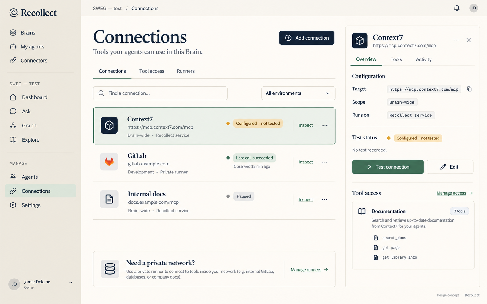
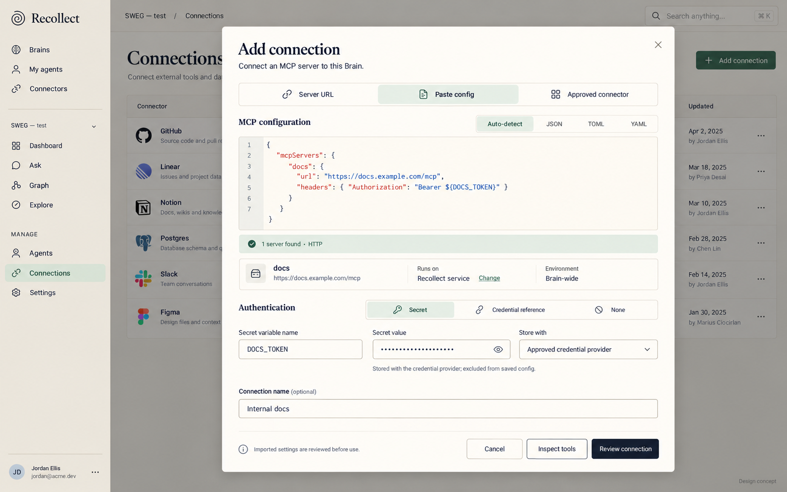
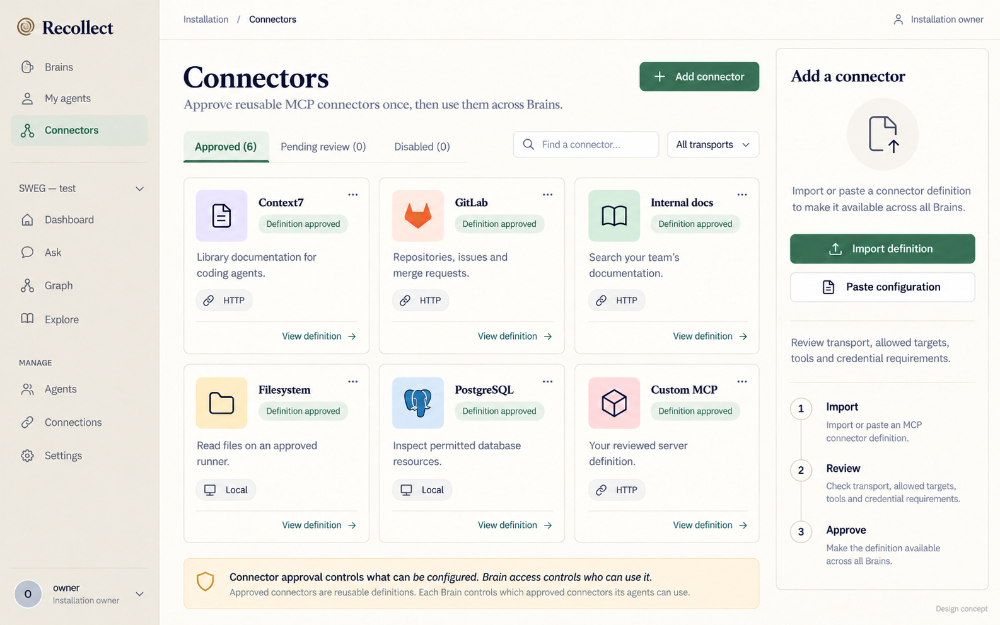
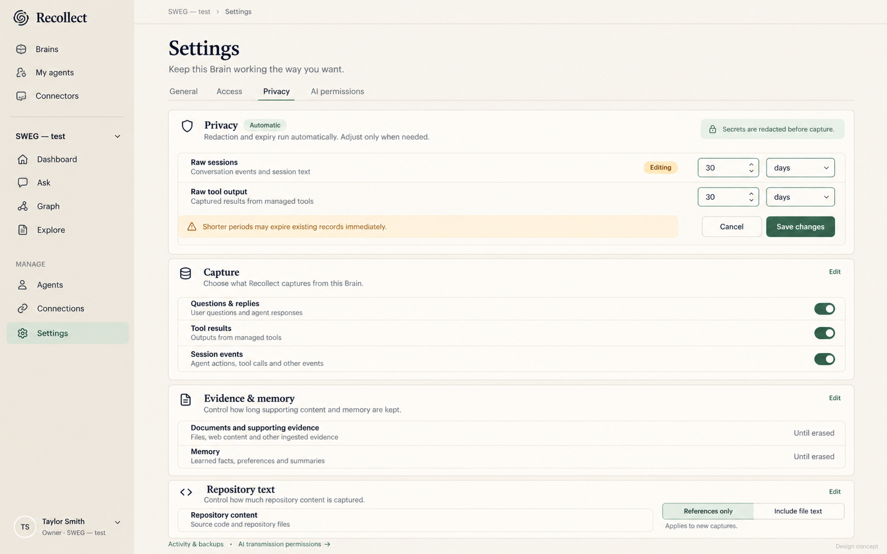
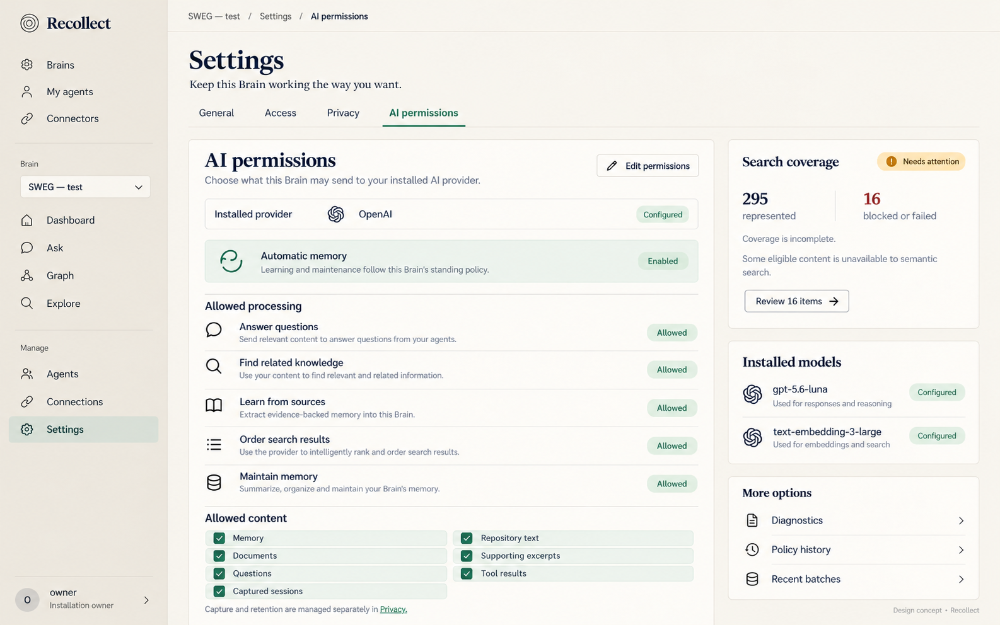
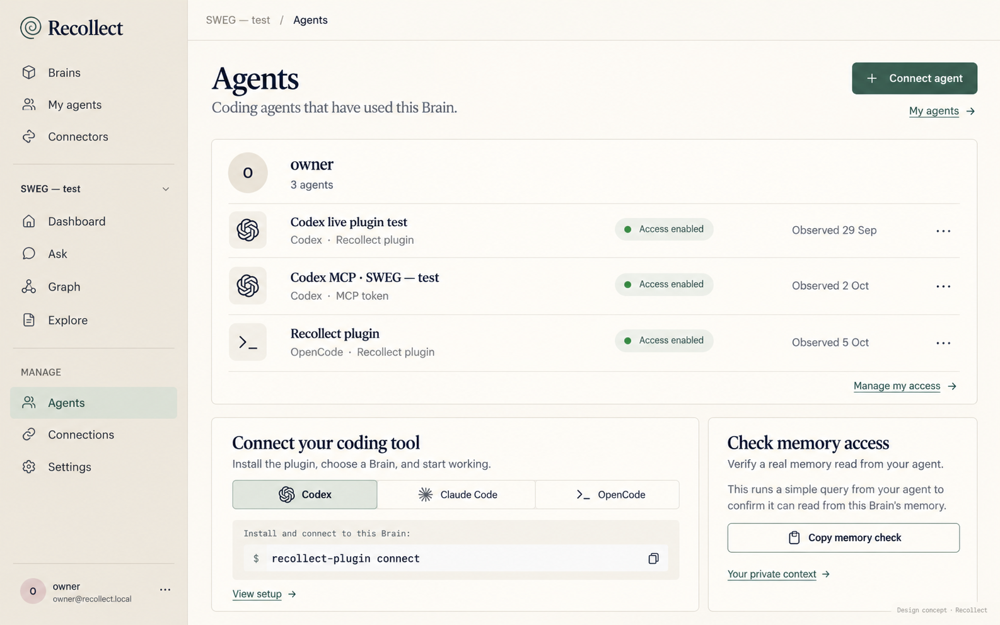

# Recollect management concepts — 5 October 2026

Generated with the built-in imagegen tool from the user's current screenshots,
annotated feedback and the live AI-permissions page. The palette and typography
follow the accepted Recollect design system.

These are visual proposals, not screenshots of implemented changes.
Names, icons, commands, tool descriptors and catalogue entries are illustrative.
Counts shown in AI permissions were visible on the page during this review.
The proposed global connector approval UI, multi-format config import and secret-entry
flow require their own implementation and governing behavior decisions.

## Recommended direction

Keep cream, ink and sage. Improve hierarchy with compact rows, focused inspectors,
clear grouping and consistent inline editing. Put reusable connector approval at the
installation level; keep configured connections and their use permissions in a Brain.
Keep diagnostics and history secondary. Never equate configured access with a live connection.

## 1. Connections

Compact connection rows, explicit observed status, and one focused inspector with Overview, Tools and Activity.

## 2. Add connection · config and credentials

One form for a server URL, pasted JSON/TOML/YAML configuration, or an approved connector, with masked secret entry and a credential-provider destination.

## 3. Connectors · installation-wide

An installation-wide connector library outside Brains, with import, review and approval.

## 4. Privacy · stable inline editing

Stable rows and inline controls when editing; nearby Save and Cancel; capture, retention and evidence remain separate.

## 5. AI permissions

Readable permissions and content classes, with incomplete search coverage visible and diagnostics secondary.

## 6. Agents

A compact observed-agent roster, host setup and a real memory-read check.

## Visual review

All six final concepts were inspected for layout, legibility, navigation, useful
density and the user's requested changes. The AI concept was corrected to describe
memory extraction into the Brain rather than provider training, and an unsupported
coverage percentage/bar was removed. The global connector concept was corrected to
remove an unrelated OpenAPI import reference. Generated marks and names vary;
implementation should reuse the existing logo and icon system.

No application source, stored settings, connections or credentials were changed.
No deployment was performed. Image review does not establish functional or accessibility acceptance.

The complete prompt set, including the two refinement prompts, is in
[prompts.json](prompts.json).

